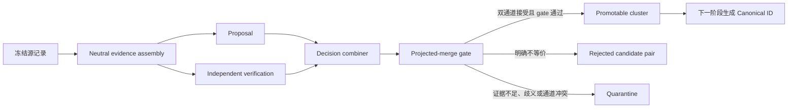

# 跨源候选对齐与晋升决策层

日期：2026-08-09
状态：待评审

## 定位

本层是**跨源候选对齐与晋升决策层**，不是 Foundation Ontology v1 的最终交付层。

它消费冻结的三源记录，产出可复核的晋升决策与内容寻址的 `promotion-bundle`。它**不生成
Canonical ID**、不发布 OntologySnapshot。Canonical 身份分配、运行时分片与 Snapshot 发布属
下一阶段。

与并行进行的 KE Core Ontology v1（`docs/superpowers/specs/2026-08-09-ke-core-ontology-v1-design.md`）
边界清晰：Core 的 Concept/Operator 全部需人工语义授权、不摄取外部源记录；本层只处理跨源自动
对齐。两者产物目录独立，互不读取。

## 本轮已确定的结论

前提在这批冻结数据上全部确定，因此结论也确定，不是「可能」：

```text
authorized_equivalence_rules        = []      # 本轮未授权任何结构化等价规则
三源间 source-asserted link         = 0
三源间 identity-level link          = 0
promotable_cluster_count            = 0       # measured
```

严格确定性路线只允许三类证据自动晋升：source-asserted exact/equivalent、identity-level 精确
链接、已版本化且已授权的结构化等价规则。前两类在三源间为空，第三类本轮为空集，所以跨三源
promotable cluster 数为 0。这是可复现的正确结果，不是失败——规范 §4.2 明确：自动化的正确结果
可以是「排除该源项」。

零并不表示两个源语义永远不等价。准确表述是：**在给定 source manifest、证据合同与规则版本下，
系统可确定性证明该候选未满足晋升条件。**

## 已测量的事实

### 证据渠道的实际可用性

| 渠道 | 实测 | 可用性 |
| --- | --- | --- |
| schema.org 自声明等价 | 55 `owl:equivalentClass` + 117 `owl:equivalentProperty` | 有效的 source-asserted 外部链接，但**无法桥接当前三源**——目标全为 `unece:`、`gs1:`、`eli:` |
| identity-level sense/roleset 链接 | 0 | PropBank 的 `lexlink`/`rolelink` 只指向 VerbNet（11,047）与 FrameNet（5,203）；schema.org 零处提及 wordnet/propbank |
| WN ∩ PB 词面重叠 | 7,782 lemma | 其中 6,096（78%）至少一侧多义 |
| WN ∩ SO 词面重叠 | 463 | 仅词面 |
| PB ∩ SO 词面重叠 | 153 | 仅词面 |
| 三源共有词面 | 148 | 仅词面 |

schema.org 的 172 条等价声明**保留在源记录中**，待 Canonical owner 形成后转为
`ExternalMapping`；不因无法桥接而丢弃。

多义率高只说明**不能依靠词面自动接受**，不等于必须 quarantine：双通道能依定义、层级、签名唯一
消歧的仍可晋升。剩余 22% 单义词面同样不能仅凭同名自动接受。

### 三源摄取计数（已实测）

| 源 | 计数 |
| --- | --- |
| WordNet 3.0 | 206,941 sense 行，147,306 distinct lemma |
| PropBank 3.4 | 7,565 frame XML、11,206 roleset occurrences、11,205 unique roleset ids、28,619 roles |
| schema.org 30.0 | 1,010 class、1,676 property、533 enumeration member |

`frames/license.xml` 是谓词 "license" 的真实 frameset（`license.01`，3 roles）。旧
`artifacts/ontology-sources/source-freeze.json` 记录 11,205 rolesets，少算一个。

`overhang.01` 同时出现在 `frames/hang.xml`（5 roles）与 `frames/overhang.xml`（2 roles），
语义与签名不同——这是 11,206 occurrences 与 11,205 unique ids 相差 1 的原因。

## 三条不变量

1. **权威与派生分离。** `combined-decisions.json` 与 `cluster-decisions.json` 保存终态权威；
   `quarantine-summary.json` 与 `alignment-metrics.json` 是派生视图，各带
   `derived_from_sha256`。
2. **中立证据先于通道。** 证据包由中立阶段生成，两个通道各自独立取用；通道二不读取通道一挑选
   后的证据包，否则仍有选择偏差。
3. **审计产物不进运行时。** 规范 §2.2：`SourceMapping`、`CrosswalkDecision`、
   `QuarantineRecord`、`BuildManifest` 只用于审计与重建，不进运行时 Snapshot 的
   `concepts[]`/`operators[]`，不被 NL2KE 读取。

## 方案

### 1. 流程



### 2. 双通道的独立性

通道二必须**同时**完成两件事，否则不能作为第二张接受票：

```text
positive sufficiency:  独立重建支持等价的证据链
falsification:         主动寻找反对等价的证据
```

只做后者的实现应改名为 Adversarial compatibility check——「未发现结构冲突」不构成「独立证明
等价」，且那些检查与 deterministic gate 重叠。

两个通道都是确定性规则实现，不调用模型：本层要交付可复现的审计产物，模型调用会使同一输入产出
不同结果，`hash reproducibility` 无法成立。规范允许「独立提示、独立排序或独立实现」三种方式，
本轮选独立实现，并**接受由此而来的覆盖率上限**。

（模型或人工判断也可先冻结为内容寻址的 review artifact，再作为确定性构建输入。因此「构建可
复现」并不必然要求评审生成过程不用模型。本轮不走这条路径。）

除输入类型隔离外，记录两个通道各自的**代码 hash、规则版本、实现身份**。

### 3. 证据与裁决的封闭词表

```text
EvidenceEntry.evidence_kind = source_asserted_link | identity_link | definition
                            | hierarchy | signature | lexical_match
EvidenceEntry.polarity      = supports | contradicts | context_only

channel_verdict             = supports_equivalence | contradicts_equivalence
                            | insufficient_evidence

CombinedDecision.disposition = promotable | rejected | quarantined
CombinedDecision.achieved_evidence_level
                            = source_asserted | identity_level
                            | independently_verified | lexical_only | none
```

`independently_verified` 是**双通道完成后的结果**，不是中立输入属性——中立阶段不得预先这样标注。

共享祖先与签名相同通常是 `context_only` 或必要条件；`lexical_only` **永远不能触发**
`promotable`。

### 4. 审计身份

依赖链分层，使修改晋升规则不改变候选身份：

```text
source_record_ref      = (artifact_sha256, member_path, native_id)
candidate_alignment_id = source refs + candidate-generation version
decision_id            = candidate_alignment_id + evidence hash + promotion-rule hash
                         + channel implementation/results
projected_cluster_id   = promotable edge 的稳定连通分量
```

若 `candidate_alignment_id` 也依赖晋升规则，改规则会让同一候选变成「另一个候选」，纵向审计
断裂。这些都不是 Ontology Canonical ID。

### 5. Projected-merge gate

不分别检查原始源记录，而是先用**临时 cluster identity 模拟合并**，再检查投影图：

- 合并是否引入 parent cycle；
- 是否让一个 cluster 同时落入 disjoint 两侧；
- Operator 签名是否仍唯一；
- Concept/Operator kind、codec 与版本是否闭合。

本层只校验 source/audit ID；Canonical ID 形态留到下一阶段。

**冲突三角整分量 quarantine**：`A~B, B~C, A!~C` 不得按遍历顺序贪心合并——那会让结果取决于
遍历顺序。整个连通分量进 quarantine。

### 6. 产物布局

```text
ontology/alignment-v1/
  source-manifest.json           新的 portable manifest
  source-records/                规范化 source-record shards
  rules/alignment-rules.v1.json  规则版本；authorized_equivalence_rules = []
  evidence/evidence-packages.json  中立证据集
  decisions/
    channel-proposal.json        通道一裁决 + 代码 hash + 实现身份
    channel-verification.json    通道二裁决 + 代码 hash + 实现身份
    combined-decisions.json      pair 终态唯一权威
    cluster-decisions.json       cluster 终态唯一权威
  promotion-bundle.json          下一阶段的内容寻址输入
  build-audit/
    build-manifest.json          无时间字段，属确定性 bundle
    quarantine-summary.json      派生视图，只存引用与统计
    alignment-metrics.json       派生视图
  run-receipt.json               可选；运行时间与本机路径，不进 bundle
```

`promotion-bundle.json` 至少保存 cluster kind、排序后的 source refs、合格等价边、投影签名与
层级、证据及 gate hash；**不生成 Canonical ID**。

**不复用旧 `source-freeze.json`**：它含错误的 PropBank 计数与绝对 `raw_path`。复用原始文件及其
SHA-256，但生成新的 portable manifest，绑定原始 source artifact、规范化 shards、
parser/schema/version、record count 与 shard hash。

### 7. 确定性字节合同

统一冻结：NFC、I-JSON、稳定数组排序、JCS、UTF-8、SHA-256、无环 hash graph。

**时间整体移出确定性 bundle**：`build-manifest.json` 无时间字段，时间与本机路径只进
`run-receipt.json`。字段不参与 hash 不等于文件字节不变——所以必须移出文件，而非在文件内标注
「不参与 hash」。

两次构建在**两个全新目录**比较完整文件清单与摘要，排除 `run-receipt.json`。

### 8. 指标交付边界

| 可测 | 报 `unknown` |
| --- | --- |
| source ingestion completeness | false merge rate（无独立 gold） |
| 候选数量、pair rejection | accepted Canonical Concept/Operator |
| quarantine 分类 | Canonical DAG closure |
| 双通道一致率 | resolved lexicalization coverage |
| 审计产物 hash reproducibility | duplicate semantic identity rate |

右列**报 `unknown`，不写 0**：本层尚未生成 Canonical Ontology，写 0 会被读成「已检查且无问题」。
用测试断言这一点，防止将来被「补齐」成 0。

## 验证方式

每条要实际输出。

1. **三源摄取完整性**——先验 archive SHA-256，再断言上表绝对计数，含 `license.xml` 的
   `license.01` 与 `overhang.01` 的三元组身份。
2. **候选与证据**——候选数量与 `evidence_kind` 分布；断言 `lexical_only` 候选无一 promotable。
3. **双通道**——一致率；不一致项全部进 quarantine 且带封闭原因码。
4. **Gate 四项注入式反例**——制造 parent cycle、disjoint 两侧命中、签名碰撞、codec 冲突；每项
   必须被拒。另加冲突三角测试，断言整分量 quarantine 且与遍历顺序无关。
5. **确定性**——两个全新目录连续构建，文件清单与摘要逐项相同（排除 `run-receipt.json`）。
6. **`unknown` 不是 0**——测试断言 `alignment-metrics.json` 右列各项确为 `unknown`。
7. **两级门禁**——portable gate 用程序化小型 source fixture（始终运行）；新增数据强制门禁校验
   固定 SHA-256 与绝对计数，**数据缺失即失败**。现有两个门禁允许 skip，无法单独证明全量计数。
8. pyright strict 0 错误、ruff 干净、依赖方向测试通过。

## 明确不做

- 不生成 Canonical ID，不发布 OntologySnapshot。
- 不用字符串相似度决定合并（规范 §1.2 禁止）。
- 不调用模型。
- 不把 synset / roleset / schema.org type 自动当作三个平行 Canonical Concept。
- 不建立全局 `Role`、`CoreRole` 或 role hierarchy；不把 ARG0/ARG1/function tag 提升为身份。
- 不改 `fixtures/ontology-snapshot-example/`、Core 的产物或 `foundation_v1/`。
- 不把审计产物写入运行时闭包。
- 不把 `unknown` 指标填成估计值或 0。
