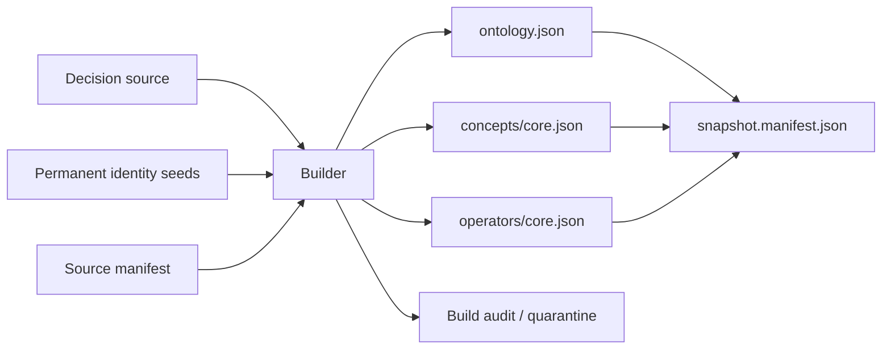
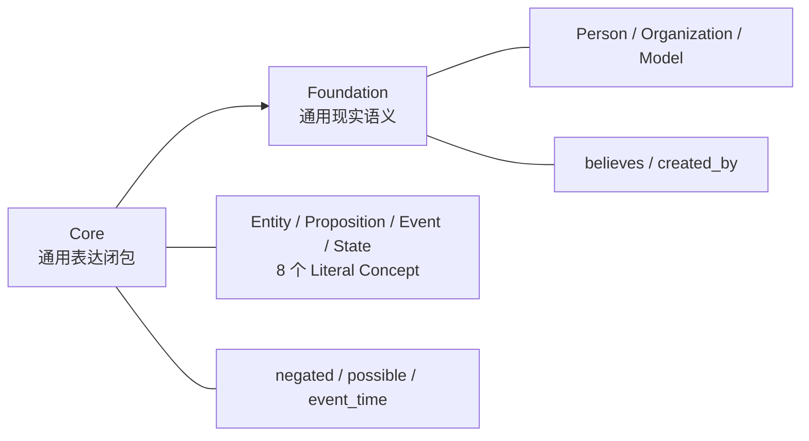

# KE Core Ontology v1 构建

日期：2026-08-09
状态：待评审

## 问题

`memory-assertion/v1` 的规范、Schema 与结构校验层已就位，但**没有权威的 Core Ontology**。
现有 `spec/memory-assertion-v1/fixtures/ontology-snapshot-example/` 是 conformance fixture，
其 Ontology 名为 `MemoryAssertionExample`，被 `tools/validate_specifications.py` 用作合同演示，
并为两处统一示例表所引。它不是、也不应成为运行时权威本体。

同时 R1 裁决暴露了一个具体缺口：表达否定所需的 `negated` Operator 不存在，且其语义授权必须
来自版本化决策记录，而非词面 attestation。

本轮交付 KE Core Ontology v1：决策源、永久身份、运行时分片、不可变 Snapshot 与验证。
**不含 Foundation 层。**

## 已测量的事实

### ID 推导规则可复现

冻结为：

```text
sha256(UTF8(kind + ":" + lowercase_hyphenated_uuid4))[0:12]
```

已在现有 fixture 的 `build-audit/id-seeds.json` 上验证：18 条种子全部复现对应
`ontology_*`/`concept_*`/`operator_*` ID，**18/18，零不匹配**。

确定性重建依赖**已持久化的 seed registry**。CSPRNG 只负责首次分配；缺 registry 时不得重新
随机生成后声称重建了原身份。

### 现有 fixture 的内容与缺口

fixture 已有 13 个 Concept（含 `Entity`、`Proposition` 与全部 8 个 literal concept 及其
`literal_value_contract`）、4 个 Operator（`created_by`、`possible`、`event_time`、`believes`，
签名与 `proposition_operation`/`function_semantics`/`positional_parameters` 齐全）。

**但 fixture 的内容构成不是 Core 的判据。** 其中 `created_by`、`Model`、`Organization`、
`believes`、`Person` 依赖实体模型，属 Foundation；见第 2.1 节的边界。Core 从 fixture 沿用的
只有 `Entity`、`Proposition` 与 8 个 literal concept 的语义定义，且**身份独立重新分配**。

对照规范 `foundation-ontology-v1-build-plan.md:139-141` 的最小内容，Core 的缺口三类：

| 类别 | 缺口 |
| --- | --- |
| Concept | `Event`、`State` |
| Operator | `negated` |
| Lexicalization | **fixture 13 个 Concept 中 11 个词面为 0**，仅 `Person`/`Organization` 各 1 条；Core 的 12 个需全部新写 |

第三项是工作量主体。规范要求中英文一等词面加来源 attestation。

### 词面来源的条件矩阵

`ontology-standard.md:427-441` 规定 `source_kind` 为封闭枚举
`wordnet | propbank | schema_org | human | domain_corpus`，且：

| `source_kind` | `sense_id` | `roleset_id` |
| --- | --- | --- |
| `wordnet` | 必须（`wn30:` 前缀） | 禁止 |
| `propbank` | 禁止 | 必须（`pb3.4:` 前缀） |
| `schema_org` / `human` / `domain_corpus` | 禁止 | 禁止 |

关键限制（`ontology-standard.md:461`）：**SourceAttestation 证明词面来源，不自动证明 owner
语义与外部资源完全等价。**

因此 literal concept（`Boolean`、`Date`、`Money` 等）使用 `human`：它们是合同定义的类型身份，
不是自然语言词义，挂 WordNet sense 属误引。通用实体概念（`Person`、`Organization`、`Event`、
`State`）可用真实 WordNet sense。

`negated` **禁止** `wn30:negate.v.01`——实测该 sense 释义为 "be in contradiction with"，
是两条断言之间的矛盾关系，不是一元逻辑否定。

## 三条不变量

1. **决策源先于运行时分片。** Operator/Concept 的语义授权来自版本化决策记录，分片是其产物。
   `provenance_refs` 指向决策文件内的条目，不指向评审文档。
2. **正式本体与 conformance fixture 分离。** `KECoreV1` 与 `MemoryAssertionExample` 是两套独立
   身份、两份 seed registry，**全部 ID 重新分配，不复用 fixture 的种子**。因此：
   - 相同 `canonical_name` **不表示**相同 Canonical ID；
   - 解析始终绑定精确 Snapshot（`snapshot_id + sha256`）；
   - fixture 的统一示例表继续使用旧 ID，Core 文档使用新 ID；
   - **不建立** fixture ID 到 Core ID 的 `exact` ExternalMapping——fixture 不是外部语义本体。

   本轮不得改动 fixture，`validate_specifications.py` 的基线必须不变。
3. **approved 条目失败即整体失败。** candidate 决策失败进 quarantine；approved 决策失败则
   Snapshot 构建失败。先建到临时目录，全部验证通过后原子替换——否则会发布一个静默缺项的
   KE Core。

## 方案

### 1. 布局

```text
ontology/core-v1/
  decisions/
    core-ontology-decisions.v1.json   决策源（权威输入）
    source-manifest.json              记录决策文件的 bytes + SHA-256
  identity/
    identity-seeds.json               永久身份输入,非可重建产物
  build-audit/
    build-manifest.json               输入版本、构建器版本、Schema hash、输出分片 hash
    quarantine.json                   candidate 失败项及原因
  ontology/ontology.json              运行时分片
  concepts/core.json                  运行时分片
  operators/core.json                 运行时分片
  snapshot.manifest.json
```

`identity/` 独立于 `build-audit/`：种子丢失后无法重建相同 ID，它是永久输入；
`build-audit/` 只保存可重新生成的构建结果。

**哈希方向单向，不循环**：`source-manifest.json` 记录整个
`core-ontology-decisions.v1.json` 的 bytes + SHA-256；`provenance_refs` 用
`core-ontology-decisions.v1.json#/decisions/<decision_id>` 定位。决策条目内不声明自己在
manifest 中的 hash。需条目级摘要时用按 JCS 计算、排除自身字段的 `decision_payload_sha256`。

**运行时闭包只含三个分片**。`decisions/`、`identity/`、`build-audit/` 不交付 NL2KE，
也不进 `snapshot.manifest.json` 的 artifacts：



### 2. 决策类型是封闭联合

不共用模糊字段。决策阶段只用 `decision_id` 互引，构建器再解析为 Canonical ID——避免在种子
生成前依赖尚不存在的本体 ID。

```text
ConceptDecision
  decision_id, canonical_name, semantic_kind, status
  parent_decision_ids, disjoint_with_decision_ids
  literal_value_contract, lexicalizations
  definition, basis, decided_at, decided_by

OperatorDecision
  decision_id, canonical_name, status
  input_concept_decision_ids, output_concept_decision_id
  positional_parameters, proposition_operation, function_semantics
  lexicalizations
  definition, basis, decided_at, decided_by
```

`status ∈ {approved, candidate}`：决定失败时的处理路径（见不变量 3）。

### 2.1 Core 与 Foundation 的边界

判据是**表达闭包**，不是"fixture 已有"。Core 只包含 KE Semantic Contract 表达自身所需的
Concept 与 Operator；任何依赖实体模型的语义进入 Foundation。



**KE Core v1：12 个 Concept**

```text
Entity  Proposition  Event  State
Boolean  Text  Decimal  Date  DateTime  Duration  Money  Quantity
```

**KE Core v1：3 个 Operator**

```text
negated(Proposition) -> Boolean       proposition_operation = modifier
possible(Proposition) -> Boolean      proposition_operation = modifier
event_time(Proposition, Date) -> Boolean
```

这三个的共同性质正是 Core 的判据：**参数只用 Core 自己的 Concept**（`Proposition`、`Date`），
不需要任何实体类型；三者都输出 Boolean，都是 `partiality=total`。

规范 `ontology-standard.md:299` 解释了 `event_time` 为何不写成 `event_time(Proposition)->Date`：
后者并非对每个 Proposition 都有定义，会与 v1 对 `partial` Operator 的无条件拒绝冲突。

**移入 Foundation**

```text
Person  Organization  Model
believes(Person, Proposition) -> Boolean
created_by(Model, Organization) -> Boolean
```

`created_by` 是普通实体关系，用于演示 Boolean predicate，不是 Semantic Contract 所必需；
`Model`、`Organization` 主要为支撑该示例而存在。它们进入 Core 的唯一理由曾是"fixture 已有"，
那不是 Core 的判据——fixture 是合同测试资产，其内容构成不能反向决定生产本体的边界。

`believes` 的归属由规范的闭合规则决定。`ontology-standard.md:299` 的表格规定
`proposition_operation=attitude` 需「恰好一个 Proposition 输入，且**至少一个非 Proposition
主体/来源输入**」。规范因此定义了 `attitude` 的通用校验规则，但并不要求 Core 提供具体的
`believes`；那个非 Proposition 主体必然是实体类型，也就必然属于 Foundation。

**不为保留 `believes` 而新增宽泛的 `Agent`。** `semantic_kind` 是粗粒度分类而非 Concept 类型
全集，枚举中没有 agent 不构成缺陷——`Agent` 若存在也只是 `semantic_kind=entity` 的普通
Concept。日后若 `Person` 过窄，应在 Foundation 单独定义语义明确的 `EpistemicAgent` 或
`BeliefHolder`；通用 `Agent` 容易混淆行动主体、认知主体、组织与模型。

fixture 中的 `believes(Person, Proposition)` 可继续作为示例，但不能据此认定它是生产 Core 内容。

**连带后果**：Core 内没有 Operator 引用 `Event`、`State`、`Text`、`Decimal`、`DateTime`、
`Duration`、`Money`、`Quantity`——它们是给 Foundation 与领域层的类型基底。这不是缺陷（literal
concept 本就是被引用而非引用者），但意味着 Core 的签名闭包验证只实际覆盖 `Proposition`、
`Date`、`Boolean` 三个。

全部 15 个条目 `status=approved`，因此任一失败即整体失败。本轮不引入 candidate——Core 的
每一条都需要人工语义授权，没有"待定后补"的位置。

### 3. 种子按 `(kind, decision_id)` 复用

**不按 `canonical_name`**。Canonical Symbol 可以修改而身份不变；只有语义变化才创建新身份：

| 情形 | 结果 |
| --- | --- |
| 已有 `decision_id` | 必须复用已存种子 |
| 新 `decision_id` | 显式分配种子 |
| `canonical_name` 改名 | 保持原种子，Snapshot hash 改变 |
| 语义定义变化 | 新 `decision_id` + 新种子，旧身份用 `deprecated`/`replaced_by` 连接 |

### 4. 构建器：分配与确定性分离

```text
build_core_snapshot.py                默认:只读。缺种子立即失败
build_core_snapshot.py --check        只重算不写盘,断言产物与决策源一致
build_core_snapshot.py --allocate-missing-seeds
                                      仅首次身份分配。CSPRNG 生成 UUIDv4,原子写入
```

构建器不能同时声称"纯确定性"又自动生成随机种子。**CI 永久禁止 seed allocation。**
确定性从种子已持久化之后开始。

步骤（规范第 6 节的九步）：

1. 校验决策文件的 bytes + SHA-256 与 `source-manifest.json` 一致，不一致即中止；
2. NFC 规范化全部 source string；
3. 校验决策图：引用可解析、无悬空、无环；
4. 解析种子：按 `(kind, decision_id)` 复用；缺失时按模式决定失败或分配；
5. 生成 Canonical ID，再把 `decision_id` 引用解析为 Canonical ID；
6. 排序并序列化分片，计算 artifact hash；
7. 生成 manifest 与 root hash；
8. 跑验证；
9. candidate 失败进 quarantine；approved 失败则整体失败。

**JCS 不排序数组**，必须显式区分：

- 语义**无序**数组按规范的无序路径表排序：`parents`、`disjoint_with`、`source_attestations` 等；
- 语义**有序**数组保持原序：`input_concepts[]`、`positional_parameters[]`。

root hash 算法与 JCS 序列化直接复用 `spec/memory-assertion-v1/tools/` 的现有实现
（含 `jcs.mjs`），不自行推测。

### 5. 验证：六项加子检查

`validate_core_snapshot.py`：

1. **Schema**——上游 Ontology Schema + Profile Schema，复用 `spec/` 的文件不复制。
   Schema 文件版本与 SHA-256 写入 build manifest，防止 Schema 漂移。
2. **身份**——`(kind, decision_id, seed, canonical_id)` 四元一致；无 ID 碰撞；
   Concept/Operator 的 `canonical_name` 分类型唯一。
3. **Concept 图**——parent DAG 无环；`disjoint_with` 无自指、且与继承闭包不冲突。
4. **Operator 签名**——`input_concepts[]`/`output_concept` 全部解析到本 Snapshot 内；
   `positional_parameters[]` 与 `input_concepts[]` 长度与 index 一致；
   `proposition_operation` 满足 Proposition 输入与 Boolean 输出规则。
5. **函数语义**——`purity=pure`、`deterministic=true`、`partiality=total`。
   任何 `partial` 进 quarantine（`foundation-ontology-v1-build-plan.md:147`）。
6. **Lexicalization 与闭包**——每条词面有 `source_attestations` 且满足条件矩阵；
   `provenance_refs` 能解析到已登记来源；manifest 的 artifact hash、记录数、root hash 与分片
   实际内容逐项一致；artifacts 只含三个运行时分片。

### 6. CI 接入

新增 `scripts/ci/check-core-ontology.sh`，跑 `--check` 加验证器。接进 `check.sh` 与
`check-portable.sh` 两处，并在 `tests/architecture/test_cicd_layout.py` 断言这两处调用——
与 `check-spec.sh` 的处理一致，避免它悄悄脱离远端门禁。

## 验收报告

按规范第 7 节逐项给出，区分两种缺失：

- `unknown`——指标适用，但没有足够证据；
- `not_applicable`——本阶段不执行该活动。

本轮的判定：

| 指标 | 本轮值 |
| --- | --- |
| source ingestion completeness | `not_applicable`（Core 不摄取外部源记录） |
| false merge rate | `not_applicable`（Core 无跨源自动合并） |
| duplicate semantic identity rate | `unknown`（指标适用，但缺独立审查） |
| accepted Canonical Concept/Operator count | 实测值 |
| quarantine count 与每类原因 | 实测值 |
| Concept parent DAG 与 Operator signature closure | 实测值 |
| lexicalization coverage（按语言、source kind） | 实测值 |
| byte/hash reproducibility | 实测值 |

## 验证方式

每条要实际输出，不接受推断。

1. **确定性**——固定 decisions + source manifest + identity seeds，连续构建两次，runtime
   shards 与 snapshot manifest **byte-identical**，`--check` 无差异。运行时产物中不得含当前
   时间等非确定字段。
2. **四个 fail-closed 测试**，分别覆盖：删除整个 seed registry、删除单个种子、篡改种子、
   制造 ID 碰撞。每项都必须失败而非静默产出。
3. **quarantine 的三条路径**——空 quarantine 是正常且有效的生产结果，不为凑数据人为降级
   任何真实条目：

   | 情形 | 期望 |
   | --- | --- |
   | 合法构建 | `quarantine.entries == []` |
   | 注入非法 candidate | 进入 quarantine，其余照常发布 |
   | 注入非法 approved | 整体构建失败，不产生正式 Snapshot |

4. **验证器六项全过**，输出计数基线。
5. **`spec/` 的 `validate_specifications.py` 基线不变**（`required_files=23` 等）——证明 Core
   与 fixture 真正分离。
6. 两个门禁全绿，pyright strict 0 错误，ruff 干净。

## 明确不做

- **不建 Foundation 层**：WordNet/PropBank/schema.org 的跨源消歧、16 万条源记录的自动对齐
  留待下一轮。理由是 Core 的 Concept/Operator 全部需要人工语义授权，Foundation 是自动对齐，
  两者验证方式与风险不同，混在一轮无法分别验证。
- 不改动 `fixtures/ontology-snapshot-example/` 与两处统一示例表。
- 不为 `negated` 使用 `wn30:negate.v.01`。
- 不实现 semantic validator、生产 Canonical Text parser、Snapshot provisioner 或 NL2KE compiler。
- 不在 CI 中允许 seed allocation。
- 不处理 R2/R3/R4：它们属于旧系统迁移与记忆侧适配，不在 Core Ontology 关键路径上。
