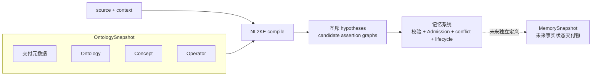
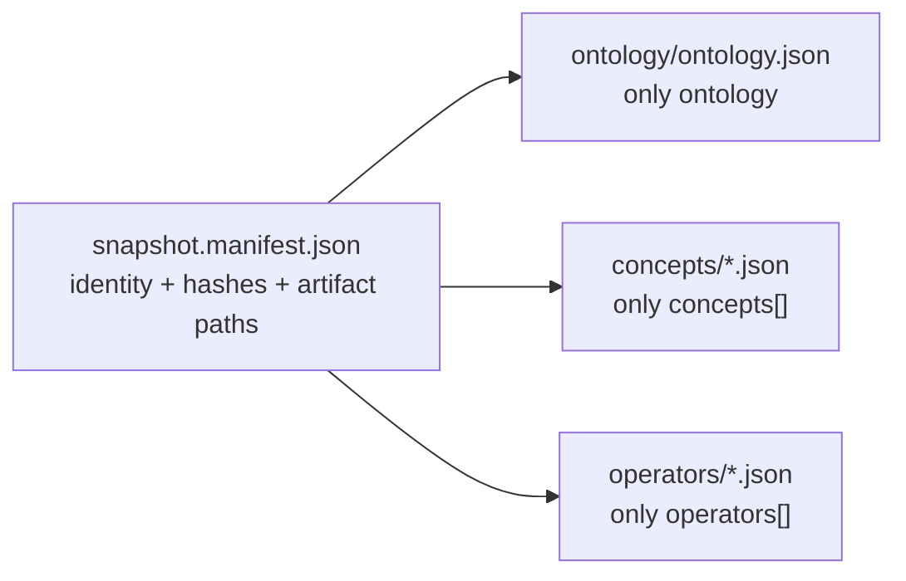

# Memory core

Memory core 是 `memory-assertion/v1` 的唯一活动规范入口。当前交付冻结语义合同、Ontology Profile、KE 语法和 Snapshot 打包规则；它不等同于已经交付 NL2KE、semantic validator、Canonical Text parser、Snapshot provisioner 或权威记忆服务。

## 合同边界

本项目在上游 Ontology Storage Specification v1 之上增加受控 Profile：

```text
Ontology = Concept + Operator
KnowledgeEquation = OperatorApplication = LeafTerm
```

- 上游继续拥有 `Ontology`、`Concept`、`Operator`、稳定 hash ID 和互斥分片格式。
- Profile 扩展只进入 `Concept.supply.memory_assertion` 与 `Operator.supply.memory_assertion`。
- Concept/Operator 的 `canonical_name` 是严格 Canonical Symbol；自然语言入口只由所属对象内嵌的 Lexicalization 提供。
- KE 使用真实的 many-sorted equality。JSON 的 `lhs/rhs` 是规范方向，不是赋值或事实接纳。
- OntologySnapshot 是 manifest 引用的不可变分片闭包，只含交付元数据、Ontology、Concept 和 Operator。compile 请求只传 `snapshot_id + sha256`。
- KE、Assertion、Candidate、Evidence、Admission 和 lifecycle 不属于 OntologySnapshot；未来事实状态快照使用独立名称 `MemorySnapshot`。
- 权威 JSON、Canonical Text 和 Display Text 分工明确，只有前两者在精确环境下允许确定性 round-trip。

对象流向固定如下：



`hypotheses[]` 是同一输入的互斥解析候选，不是事实冲突集合；不得跨 hypothesis 合并 candidate graph。NL2KE 也不负责跨 turn 的 conflict、merge 或 supersession。量词、变量绑定以及 `AND`、`OR`、`IF` 不受 `memory-assertion/v1` 支持，必须报告为 `reported_capability_gaps[].code=unsupported_construct`，不得伪装成 Ontology Gap。

## 三个容易混淆的点

### Snapshot 不是一个大 JSON

生产权威形态是 manifest 引用互斥分片：



所以 `ontology`、`concepts[]`、`operators[]` 不塞进同一个生产 JSON。单文件 expanded bundle 只允许作为可删除的测试视图。

### “创建”不是映射到英文 `create`

Lexicalization 由所属对象隐式给出目标：

```text
operator_fe9dd6d99ebf / created_by
  ├─ zh-CN surface_form = 创建
  └─ en    surface_form = create
```

两条词面都指向 owner 的 Operator ID。它们彼此不是翻译边，`created_by` 也只是 Canonical Symbol，不是权威 ID。

### `function_semantics` 描述什么

| 字段 | v1 含义 |
| --- | --- |
| `purity=pure` | 结果只依赖有序签名中的显式输入；时间、状态版本或数据快照若影响结果，也必须作为普通输入显式建模 |
| `deterministic=true` | 同一完整输入在同一解释合同下得到同一结果 |
| `partiality=total` | 对所有合法签名输入有定义 |
| `partiality=partial` | 只在定义域内有定义；Schema 只保留前向结构，任何含此值的 `memory-assertion/v1` runtime Snapshot 都必须拒绝 |

这些字段不评价模型质量、事实真值、知识完备性或 Admission。

## 阅读入口

规范按以下顺序阅读：

1. [`memory-assertion/v1` 总览](docs/specifications/memory-assertion-v1/README.md)
2. [规范词汇表](docs/specifications/memory-assertion-v1/normative-vocabulary.md)
3. [KE 语义与语法标准](docs/specifications/memory-assertion-v1/ke-semantic-syntax-standard.md)
4. [Ontology Profile 标准](docs/specifications/memory-assertion-v1/ontology-standard.md)
5. [OntologySnapshot 打包标准](docs/specifications/memory-assertion-v1/ontology-snapshot-packaging.md)
6. [NL2KE 对接要求](docs/specifications/memory-assertion-v1/nl2ke-integration-requirements.md)
7. [Foundation Ontology v1 构建方案](docs/specifications/memory-assertion-v1/foundation-ontology-v1-build-plan.md)
8. [合同迁移设计](docs/specifications/memory-assertion-v1/2026-08-08-memory-assertion-v1-contract-migration-design.md)

机器合同位于 `docs/specifications/memory-assertion-v1/schema/`。上游 Ontology Storage Specification 的固定副本位于 `docs/specifications/memory-assertion-v1/references/`；该副本只用于版本绑定，不由本 Profile 改写。

可执行 conformance fixture 位于 `fixtures/ontology-snapshot-example/`。验证环境必须提供：

- Python 与 `jsonschema>=4`（开发依赖见 `requirements-dev.txt`）；
- Node.js，用于 `tools/jcs.mjs` 的 RFC 8785 JCS 序列化；该 helper 无 npm 依赖。

运行（从仓库根）：

```bash
scripts/ci/check-spec.sh
```

或在本目录运行：

```bash
python tools/validate_specifications.py
```

## 统一示例身份

所有活动文档只能按下表解释这些示例身份：

| kind | ID | `canonical_name` |
| --- | --- | --- |
| Ontology | `ontology_9a0634222551` | `MemoryAssertionExample` |
| Concept | `concept_58fa53e5ab6d` | `Entity` |
| Concept | `concept_72c9781aa03b` | `Person` |
| Concept | `concept_32ad50552813` | `Organization` |
| Concept | `concept_fd8836ad6c9c` | `Model` |
| Concept | `concept_b39c9a889cc6` | `Boolean` |
| Concept | `concept_9bdb3283cc8f` | `Date` |
| Concept | `concept_441bafa9e9ed` | `Proposition` |
| Concept | `concept_b809c63d2ee0` | `Quantity` |
| Concept | `concept_400b1a5cb986` | `Decimal` |
| Concept | `concept_35f01a413e72` | `DateTime` |
| Concept | `concept_8b17e273c98f` | `Duration` |
| Concept | `concept_b4bdacfaaec4` | `Money` |
| Concept | `concept_13c81bbb1b78` | `Text` |
| Operator | `operator_fe9dd6d99ebf` | `created_by` |
| Operator | `operator_7e2261ee9c51` | `possible` |
| Operator | `operator_61921190c148` | `event_time` |
| Operator | `operator_0e0ca38b526f` | `believes` |

其中 `created_by` 的 Canonical Text 示例固定为：

```text
created_by(Model__gpt_4,Organization__openai)=Boolean::true
```

## 当前成熟度

本目录中的规范和 Schema 是实现合同。只有在对应程序、测试向量和新鲜验证结果存在时，才可以分别声称结构校验、语义校验、文本 round-trip、Snapshot provisioning 或 NL2KE 编译已经实现。规范本身不构成这些实现证据。
