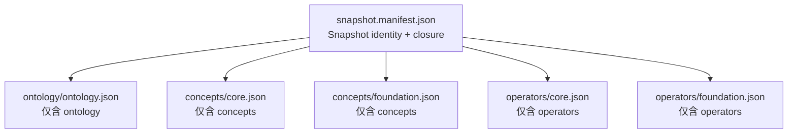

# Memory Assertion v1 合同一致性迁移设计

**状态**：已迁移到 `Memory core` 规范包；以同目录活动标准与 Schema 为权威  
**日期**：2026-08-08  
**目标 Profile**：`memory-assertion/v1`  
**上游基线**：`D:\86137\ontology.schema.json`、`D:\86137\ontology.schema.md`  
**迁移方式**：原路径一致性迁移，不保留旧字段兼容别名

## 1. 目标

本迁移把当前分散在 Schema、Foundation Ontology 规范、NL2KE 对接文档、示例和术语表中的多套旧合同收束为一套可执行的 `memory-assertion/v1` 设计。

迁移完成后：

1. Ontology identity 只有 `Concept` 和 `Operator`；
2. KE 使用真实、many-sorted equality，机器形态固定为 `OperatorApplication = LeafTerm`；
3. Role、CoreRole、designated output、qualifiers、独立 ValueType 和顶层 Lexicalization 不再存在；
4. Lexicalization、Operator 约束和 literal contract 只作为 Concept/Operator 的 profile 支撑数据；
5. NL2KE 只读取精确 Snapshot、返回候选断言和证据，不创建本体身份或权威记忆；
6. 权威 JSON、Canonical Text 和 Display Text 具有明确且互不混用的边界；
7. 所有公共诊断使用按 code 封闭的联合类型。

## 2. 非目标

本迁移不实现：

- Admission、Lifecycle、冲突合并或权威 claim 写入；
- L2、查询、检索、embedding 或 SQL；
- 任意逻辑规则、AND/OR/IF 执行或递归命题；
- NL2KE 自动扩展本体；
- Snapshot 构建器、Canonical Text parser 或 semantic validator 的运行时代码；
- Foundation Ontology 三源数据的重新构建或质量验收。

Schema 和文档会冻结这些运行时组件必须执行的合同，但不得据此声称组件已经实现。

## 3. 权威层级

```text
Ontology Storage Specification v1
  -> 定义 Concept、Operator 和上游 ID 规则

memory-assertion/v1 Semantic Contract
  -> 收紧 supply.memory_assertion、KE、Candidate、Snapshot 和 NL2KE 合同

Authoritative JSON
  -> 结构和语义闭合后的权威序列化

Canonical Text
  -> 绑定精确环境的确定性可逆投影

Display Text
  -> 不可反向解析的展示投影
```

上游 Ontology Storage Specification 不修改。Profile 扩展只进入：

```text
Concept.supply.memory_assertion
Operator.supply.memory_assertion
```

发生冲突时，当前 Schema、Schema Guide 和 Foundation Ontology v1 规范必须在同一迁移中一致更新，不能让任一旧文档继续被解释为第二套活动合同。

## 4. OntologySnapshot v1

### 4.1 逻辑闭包与物理分片

`OntologySnapshot` 是一个不可变的**逻辑闭包**，不是要求把全部内容塞进一个 JSON 对象。上游 Ontology Storage Specification 明确规定三类文档互斥：单个分片只能包含 `ontology`、`concepts` 或 `operators` 之一。因此生产交付采用一个内容寻址清单引用上游兼容分片：



权威 Snapshot 清单示例：

```json
{
  "document_kind": "ontology_snapshot_manifest",
  "ontology_schema_id": "https://genuineknowledge.com/specifications/ontology/v1/ontology.specification.json",
  "semantic_contract_version": "memory-assertion/v1",
  "profile": "memory-assertion/v1",
  "snapshot_id": "memory-assertion-example-v1",
  "sha256": "6163b7f30ed60650d3f4361d3a8368c3901619e92d25114bb4667339e1286787",
  "source_manifest": [
    {
      "source_id": "memory-assertion-example/v1",
      "source_kind": "core_ontology",
      "version": "1.0.0",
      "sha256": "8913911f3664c0a0061db575a401ad579534b58573808a2d998dd56038684dbd",
      "provenance_refs": ["sources/memory-assertion-example/v1/manifest.json"]
    }
  ],
  "required_capabilities": [],
  "artifacts": [
    {
      "artifact_kind": "ontology",
      "path": "ontology/ontology.json",
      "media_type": "application/json",
      "sha256": "189faf1b88c0d6abbf6a70cd8f7c7569089c119e7e9ec88d3dc34a841e9a3902",
      "record_count": 1
    },
    {
      "artifact_kind": "concepts",
      "path": "concepts/core.json",
      "media_type": "application/json",
      "sha256": "562c61c40518417771ed5a55a7db6482f2f91f32d5282184ee15afc042ba3c24",
      "record_count": 13
    },
    {
      "artifact_kind": "operators",
      "path": "operators/core.json",
      "media_type": "application/json",
      "sha256": "dd098ca698095e32daa70b9d60911e68c0ba64e1e17e059a9f254c77277a33c3",
      "record_count": 4
    }
  ]
}
```

Snapshot 清单禁止内联 `ontology`、`concepts`、`operators`，也禁止出现：

```text
roles
core_roles
value_types
constraints
crosswalks
lexicalizations
```

每个 `artifacts[]` 项都绑定相对路径、媒体类型、内容 hash 和记录数。清单必须恰好引用一个 `ontology` 分片，并引用至少一个 Concept 分片和一个 Operator 分片；所有分片共同构成运行时闭包。小型测试可以生成单文件 expanded bundle，但它是可删除的派生视图，不是第二份权威，也不能被 compile 请求直接内联。

Literal contract 放在对应 Concept 中；Operator 约束放在对应 Operator 中；Lexicalization 内嵌于所属 Concept/Operator。Crosswalk、SourceMapping 和来源决策属于构建审计产物，只通过 `source_manifest` 和 provenance 回指，不成为运行时 KE 可引用身份。

### 4.2 不可变性和 hash

- `snapshot_id + sha256` 唯一确定整个逻辑闭包；
- Unicode 规范化使用 NFC；
- JSON canonicalization 使用 JCS；
- 编码使用 UTF-8；
- hash 使用 SHA-256 lowercase hex；
- 每个分片的 `sha256` 是该分片 NFC 归一、JCS 序列化后的 UTF-8 字节 hash；
- Snapshot 根 `sha256` 是移除清单顶层 `sha256` 字段后，对其 NFC 归一，并按活动打包标准稳定排序所有语义无序数组，再做 JCS 序列化所得 UTF-8 字节的 hash；
- 因为清单包含所有分片 hash，根 hash 传递性绑定完整闭包；
- Concept/Operator 内嵌的 Lexicalization 参与 Snapshot 内容 hash；
- 由它们派生的运行时只读词面索引不重复序列化，也不额外参与 hash；
- 纯 symbol 或词面修改不自动改变 canonical ID，但必须产生新 Snapshot hash；
- 如果修改伴随语义定义变化，必须创建新 canonical ID，并用 `deprecated/replaced_by` 连接旧身份。

## 5. Lexicalization v1

### 5.1 唯一载体

Lexicalization 只保存在：

```text
Concept.supply.memory_assertion.lexicalizations[]
Operator.supply.memory_assertion.lexicalizations[]
```

目标由所属 Concept 或 Operator 隐含确定。禁止保存第二份带 `target_id` 的顶层词汇表。

NL2KE 可以确定性派生只读索引：

```text
(language, NFC(surface_form)) -> targets[]
```

该索引只是缓存，不是权威数据。

### 5.2 结构

```json
{
  "language": "zh-CN",
  "surface_form": "创建",
  "surface_relation": "canonical_label",
  "disambiguation_status": "resolved",
  "source_attestations": [
    {
      "source_kind": "human",
      "lemma": "创建",
      "provenance_refs": [
        "sources/memory-assertion-example/v1/manifest.json#/lexicalizations/create_zh"
      ]
    }
  ]
}
```

`surface_relation` 只允许：

```text
canonical_label
equivalent_expression
abbreviated_expression
surface_variant
```

`disambiguation_status` 只允许：

```text
resolved
candidate
```

`resolved` 表示当前词面-目标映射对已确认，不表示该词面在整个 Snapshot 中只有一个目标。同一词面可以在多个 Concept/Operator 上都有 `resolved` 记录；具体 source occurrence 仍由 NL2KE 根据上下文、类型和 Operator 签名消歧。

`candidate` 只是一项识别候选，不能单独成为最终语义选择依据。

### 5.3 SourceAttestation

每条 Lexicalization 必须有至少一条 `source_attestations`。每条 attestation：

- `additionalProperties=false`；
- `source_kind` 为封闭枚举：`wordnet | propbank | schema_org | human | domain_corpus`；
- `lemma` 必填；
- `provenance_refs.minItems >= 1`。

来源条件：

```text
source_kind=wordnet
  -> sense_id 必填
  -> roleset_id 禁止

source_kind=propbank
  -> roleset_id 必填
  -> sense_id 禁止

source_kind=schema_org|human|domain_corpus
  -> sense_id 禁止
  -> roleset_id 禁止
```

只有 lemma、没有精确 sense/roleset 的记录不得声称来自 WordNet 或 PropBank，应使用 `human` 或 `domain_corpus`。

### 5.4 与其他映射的边界

Lexicalization 不再使用 `mapping_relation`。以下关系只属于：

```text
ExternalMapping.relation = exact | narrow | broad | related
```

三源构建阶段的 SourceMapping 继续使用独立合同，不能与运行时 Lexicalization 或 ExternalMapping 混用。

## 6. Operator Profile Contract

### 6.1 上游函数签名

Operator 保持：

```text
input_concepts[] -> output_concept
```

- `input_concepts[]` 的顺序决定参数绑定顺序；
- `output_concept` 决定 rhs 的 Concept 范围；
- `positional_parameters[n]` 对应 `input_concepts[n]`，只提供局部名称、定义和约束说明；
- 不存在 Role、CoreRole、designated output role、`roles[]` 或 `role_id`；
- `operator_id` 和 `concept_id` 是权威身份；
- `canonical_name` 在本 Profile 中承担 Canonical Symbol。

### 6.2 proposition_operation

删除 `operator_form` 及其旧枚举。Operator profile 必须保存：

```json
"proposition_operation": "none"
```

允许：

```text
none
modifier
attitude
relation
```

输出形态由 `output_concept` 和对应 Concept 的语义推导，不另外保存 function/predicate 分类。`connective` 不进入 v1。

### 6.3 命题修饰

删除：

```text
qualifiers.polarity
qualifiers.modality
qualifiers.temporal
```

否定、模态、命题时间和有效期统一由接受 AssertionRef 的 Operator 表达：

```text
negated(Assertion::candidate::"created-by-1")=Boolean::true
possible(Assertion::candidate::"created-by-1")=Boolean::true
event_time(Assertion::candidate::"created-by-1",Date::"2026-08-09")=Boolean::true
```

### 6.4 Function semantics

删除：

```text
referential_transparency
extensional
```

保留：

```json
{
  "function_semantics": {
    "purity": "pure",
    "deterministic": true,
    "partiality": "total"
  }
}
```

- `purity=pure`：结果只依赖有序签名中的全部显式参数；时间、状态版本或数据快照若影响结果，也必须作为普通输入进入 `input_concepts[]` 与 `positional_parameters[]`；
- `deterministic` 在 v1 固定为 `true`；
- referential transparency 由纯性、确定性和 equality contract 派生，不重复存储；
- equality congruence 属于 Semantic Contract，不表示 Operator function extensionality。

### 6.5 Partial Operator

`definedness_contract` 位于 `Operator.supply.memory_assertion`，与 `function_semantics` 并列：

```json
{
  "function_semantics": {
    "purity": "pure",
    "deterministic": true,
    "partiality": "partial"
  },
  "definedness_contract": {
    "contract_id": "ke-definedness/v1",
    "required_input_indexes": [0, 1],
    "failure_behavior": "reject_application"
  }
}
```

条件：

```text
partiality=partial -> definedness_contract 必填
partiality=total   -> definedness_contract 禁止
```

未知 contract、非法 input index、缺少已登记的 Operator-specific definedness predicate 或无法机器验证的定义条件使 Snapshot 或 OperatorApplication fail-closed。不得用自然语言或未知 DSL 替代封闭合同。`memory-assertion/v1` runtime Snapshot 尚不交付内容寻址的 definedness registry，因此任何 `partial` Operator 都必须进入 quarantine 并使 provisioning 失败；`required_capabilities[]` 不能绕过该规则。

### 6.6 Boolean predicate

多对多关系把所有参与项放入输入，并输出 Boolean：

```text
created_by(Model__gpt_4,Organization__openai)=Boolean::true
```

禁止裸等式：

```text
Model__gpt_4=Organization__openai
```

也禁止以同一输入配多个互不相等 rhs 模拟多值关系。

## 7. KE、Term 与 Candidate Graph

### 7.1 Equality 语义

`=` 是真实的 many-sorted equality，不是赋值、关系箭头或 designated-output 绑定符。对同一 hypothesis 中类型兼容、语义闭合的 Term，至少满足：

```text
reflexivity
symmetry
transitivity
congruence
scope-bounded substitution
```

Profile 只允许规范方向 `OperatorApplication = LeafTerm`，因此 equality 的对称性不要求保存一条反向 JSON，也不允许 NL2KE 输出裸 `LeafTerm = LeafTerm`。JSON 中 `lhs/rhs` 的顺序是规范序列化方向，不削弱 equality 的语义。

Equality 不自动提供：

- Concept extensionality；
- Operator function extensionality；
- 跨 hypothesis 替换；
- 跨 Snapshot 替换；
- Admission、现实真值或来源忠实度结论。

所有替换都必须保持 Term kind、Concept 类型、AssertionRef scope 和 Snapshot identity 兼容。

### 7.2 唯一 Term 模型

```text
KnowledgeEquation := OperatorApplication "=" LeafTerm

OperatorApplication := operator_id + ordered arguments[]

LeafTerm :=
  individual_ref
  | typed_value
  | assertion_ref
  | ontology_concept_ref
  | ontology_operator_ref
```

活动文档中的以下旧模型全部删除：

```text
concept_ref
canonical_individual_ref
local_individual_ref
value_ref / ValueCandidate
candidate_assertion_ref
canonical_assertion_ref
colon-style ontology IDs in *_id fields
```

scope 由统一引用对象的 `scope=local|canonical` 表达。Ontology ID 继续遵守上游：

```text
concept_<12 lowercase hex>
operator_<12 lowercase hex>
```

### 7.3 Candidate Assertion

```json
{
  "candidate_id": "ke-1",
  "ke": {
    "lhs": {},
    "rhs": {}
  },
  "candidate_metadata": {
    "speech_act": "assertion",
    "epistemic_mode": "self_reported",
    "semantic_assessment": {
      "label": "uncertain",
      "score": null,
      "score_semantics": "not_provided",
      "uncertainty_codes": ["possible_ambiguity"],
      "reasons": ["词面存在两个类型兼容的候选"]
    }
  },
  "support_basis": "direct_source",
  "source_evidence_ids": ["ev-1"],
  "context_support_refs": []
}
```

`candidate_metadata`：

- 整体可选；
- `additionalProperties=false`；
- `minProperties=1`；
- 空对象非法；没有元数据时直接省略；
- `speech_act`、`epistemic_mode`、`semantic_assessment` 均可选；
- 不支持时必须省略，不生成默认 `assertion`、`unknown` 或虚假分数；
- 不参与 KE 身份、类型校验、equality、Admission 或现实真值。

`semantic_assessment`：

```text
score_semantics=not_provided
  -> score 必须为 null

score_semantics=uncalibrated_relative|calibrated_probability
  -> score 必须为 0..1
```

`label` 只允许 `supported | uncertain`，禁止 `accepted | true | authoritative`。

Hypothesis 不再保存第二份 `semantic_assessment`；所有 NL2KE 自评只允许出现在单条 Candidate 的可选 `candidate_metadata` 中。

### 7.4 Hypothesis 与 status

```text
compiled
  -> hypotheses 非空
  -> 每个 hypothesis.candidate_assertions 非空
  -> 每个 hypothesis.root_candidate_ids 非空
  -> abstention_reasons 为空

abstained
  -> hypotheses 为空
  -> abstention_reasons 非空
  -> 不存在 candidate assertion
```

语义 validator 必须检查：

- root 引用当前 hypothesis 中存在的 candidate；
- 所有 non-root candidate 从至少一个 root 经 assertion_ref 可达；
- 禁止孤立 candidate、自引用和循环；
- 默认禁止跨 hypothesis candidate ref；
- 不保存 `embedded_candidate_ids`；
- root 不表示可信或已 Admission；
- 同一 candidate 可以被多个上层 candidate 引用；
- 同时被原文独立陈述的 embedded candidate 必须也列为 root。

## 8. Canonical Symbol 与 Canonical Text

### 8.1 三层分离

```text
Canonical ID      权威身份
Canonical Symbol  严格文本语法符号
Lexicalization    自然语言识别入口
```

Profile 对 `canonical_name` 收紧：

```text
Operator: ^[a-z][a-z0-9_]*$
Concept:  ^[A-Z][A-Za-z0-9]*$
```

Concept 和 Operator symbol 分别在 Snapshot 内唯一。冲突时 Snapshot 构建失败，不能通过 Lexicalization 消歧。

### 8.2 Individual symbol

LocalIndividualDeclaration 和 CanonicalBinding 增加：

```json
{
  "individual_id": "individual-123",
  "local_symbol": "xiaowang",
  "naming_concept_id": "concept_123456789abc",
  "concept_ids": [
    "concept_123456789abc",
    "concept_abcdef123456"
  ]
}
```

规则：

```text
local_symbol -> ^[a-z][a-z0-9_]*$
naming_concept_id in concept_ids
naming Concept 必须存在于精确 Snapshot
rendered symbol = NamingConcept__local_symbol
```

同一 ClosedHypothesisBundle 中，local declarations 与 canonical bindings 展开后的 Individual symbol 必须全局唯一。local/canonical 碰撞直接拒绝。

### 8.3 Canonical Text

唯一形式：

```text
OperatorSymbol(LeafTerm,...)=LeafTerm
```

叶项：

```text
IndividualRef       Person__alice
TypedValue          Date::"1990-01-01"
                    Boolean::true
                    Money::{"amount":"12.50","currency":"CNY"}
CandidateAssertion  Assertion::candidate::"created-by-1"
CanonicalAssertion  Assertion::canonical::"claim/session-1:203"
ConceptRef          Concept::Person
OperatorRef         Operator::created_by
```

Canonical Text 不插入可选空格。JSON string、object 和 array 使用 JCS 兼容形式。AssertionRef ID 固定使用 JSON string，因此不引入第二套 escaping。当前 RuntimeId 规则保持不变；文本语法对未来 Unicode ID 仍使用 JSON escaping。

### 8.4 Round-trip 环境

解析必须绑定：

```text
snapshot_id + sha256
current hypothesis local declarations
shared canonical bindings
candidate assertion ID table
canonical assertion ID table
```

必须满足：

```text
parse(render(authoritative_knowledge_equation_json, environment), environment)
  = canonicalize(authoritative_knowledge_equation_json)
```

该等式只覆盖一条 `KnowledgeEquation` JSON AST，不覆盖 Candidate metadata、Evidence、Hypothesis 或整个响应。任何 Snapshot、symbol、binding、AssertionRef、类型、参数数量或 literal codec 不匹配都 fail-closed。

权威存储仍是语义闭合 JSON；JCS JSON 字节用于 hash。Canonical Text 是环境相关但确定性可逆的投影，不替代 JSON。Display Text 可以本地化和格式化，但禁止反向解析。

## 9. NL2KE Snapshot 和 Evidence 边界

### 9.1 Request

正常 compile 请求只携带：

```json
{
  "ontology_snapshot_ref": {
    "snapshot_id": "memory-assertion-example-v1",
    "sha256": "6163b7f30ed60650d3f4361d3a8368c3901619e92d25114bb4667339e1286787"
  }
}
```

删除 `ontology_delivery` 和 inline Snapshot 分支，不保留兼容别名。

NL2KE 必须：

- 从本地不可变缓存解析精确 Snapshot；
- 缓存缺失、hash 不匹配或校验失败时 fail-closed；
- 不降级到其他版本；
- 不用网络临时补齐；
- 响应以 `ontology_snapshot_ref` 回显实际使用的 ID/hash。

Snapshot provisioning 是独立流程，不属于单次 compile 请求。

### 9.2 Evidence

Evidence 不属于 Ontology 或 KE Core。响应顶层去重保存：

```json
{
  "evidence_id": "ev-1",
  "message_id": "message-1",
  "message_revision_id": "message-1/rev-3",
  "start_char": 0,
  "end_char": 8,
  "quote": "小王可能明天离开",
  "quote_sha256": "888c2d761a7cedd8b3cda5cd600a5e1030924420b53b23dec1b00078c1d9b46b"
}
```

Candidate 只保存 `source_evidence_ids`。`message_revision_id` 或等价消息版本 hash 必须保留，以便原文修订后仍能确定性回放 offsets 和 quote。

系统 Evidence 引用禁止建模为 Core `supports(Evidence, Proposition)=true`。只有原文自身明确陈述证据支持关系时，才作为普通 Domain Operator 编译。

### 9.3 Exchange hash

交换层单独冻结可复算摘要，不复用 Snapshot 的语义数组排序/NFC canonicalization：`binding_sha256` 和 `assertion_sha256` 删除自身字段后按严格 JSON + RFC 8785 JCS + UTF-8 + SHA-256；`request_hash` 深拷贝完整请求，仅删除 `execution.credential.credential_ref`，保留 caller-owned HMAC `credential_ref_fingerprint` 后按同一算法计算；source/context 原文不做 NFC。所有 JCS 输入必须拒绝超出 IEEE-754 安全整数范围的整数、非有限数和未配对 Unicode surrogate。`credential_ref_fingerprint` 由调用方以 caller-owned key 对精确 credential ref 执行 HMAC-SHA-256，服务只能回显，禁止把低熵原始引用放入裸 hash preimage。`prompt_sha256` 只绑定不可变 prompt artifact 原始字节，不包含动态 source。

## 10. 诊断合同

### 10.1 四类响应诊断

```text
reported_ontology_gaps
reported_capability_gaps
unresolved_items
warnings
```

四个响应字段都必须存在，值为数组；没有对应诊断时返回空数组，不得省略或返回 `null`。

统一外壳：

```json
{
  "code": "example_closed_code",
  "payload": {},
  "display_message": "可选说明"
}
```

机器只依赖 `code + payload`。每个 code 使用独立 oneOf 分支；外壳和 payload 均 `additionalProperties=false`。未知 code、未知 payload 字段和开放 `details` 全部拒绝。

### 10.2 Ontology Gap

```text
missing_concept
  -> evidence_id, surface_form

missing_operator
  -> evidence_id, surface_form

incompatible_type
  -> evidence_id, operator_id,
     location(input + input_index | output),
     expected_concept_ids, actual_concept_ids

unsupported_literal_codec
  -> evidence_id, concept_id, required_codec_id

unrepresentable_span
  -> evidence_id
```

`unsupported_literal_codec` 专指 Snapshot 没有能够表达该来源值的兼容 literal contract。Snapshot 已声明但编译器不支持的 required capability 必须在能力协商阶段 fail-closed。

### 10.3 Capability Gap

v1 code：

```text
unsupported_construct
  -> evidence_id, construct
```

`construct`：

```text
logical_connective
conditional
quantifier
variable_binding
inline_assertion
cyclic_proposition
cross_hypothesis_reference
multi_output_operator
arbitrary_rule
```

AND/OR 属于 `logical_connective`，IF 属于 `conditional`。Capability Gap 表示 Profile 或 NL2KE 能力不足，不得误报为 Ontology Gap。

### 10.4 Unresolved

```text
ambiguous_lexical_mapping
  -> evidence_id, candidate_targets[]

unresolved_individual
  -> evidence_id, mention

unresolved_assertion_scope
  -> evidence_id, scope_options

unresolved_time
  -> evidence_id, expression, required_anchor_kinds

unresolved_value
  -> evidence_id, expression, expected_concept_ids

insufficient_context
  -> evidence_id, required_context_kinds
```

异构 lexical candidates：

```json
{
  "code": "ambiguous_lexical_mapping",
  "payload": {
    "evidence_id": "ev-1",
    "candidate_targets": [
      {
        "target_kind": "concept",
        "target_id": "concept_123456789abc"
      },
      {
        "target_kind": "operator",
        "target_id": "operator_abcdef123456"
      }
    ]
  }
}
```

约束：

- `candidate_targets.minItems >= 2`；
- `target_kind = concept | operator`；
- `target_id` 必须符合相应 ID 格式；
- `(target_kind, target_id)` 必须唯一；
- unresolved 项不得在 KE 中创建 placeholder。

### 10.5 Warning

```text
normalization_applied
  -> evidence_id, rule_id

model_output_repaired
  -> repair_kind: json_syntax | schema_shape
```

任何修复后响应仍必须重新通过不可关闭的完整结构校验。新增 warning code 需要协议升级。

### 10.6 Abstention

`abstention_reasons` 使用同样的封闭外壳：

```text
no_compilable_ke
  -> cause:
     ontology_gap | capability_gap | semantic_ambiguity |
     insufficient_context | truncation

insufficient_context
  -> required_context_kinds

source_not_interpretable
  -> focus_message_ids

budget_exhausted
  -> budget_dimension:
     model_calls | input_tokens | output_tokens | deadline
```

### 10.7 Coverage

NL2KE 只报告 `processing_scope`、上述诊断和实际执行信息。禁止返回自评：

```text
source_coverage
ontology_coverage
truth
accepted
authoritative
```

真实 source/ontology coverage 和语义忠实度由记忆系统或独立 evaluator 使用私有 gold 计算。

## 11. HTTP 与业务状态

```text
HTTP 200 + status=compiled
HTTP 200 + status=abstained
HTTP 4xx/5xx + document_kind=nl2ke_error
```

`compiled` 不表示“服务调用成功”；它只表示至少编译出一条闭合 candidate KE。Gap、unresolved 和 warning 可以与 compiled 并存，但不能描述已经进入 candidate graph 的未闭合 placeholder。

数据面固定为 `POST /v1/compile`；能力协商和就绪检查固定为 `GET /v1/capabilities` 与 `GET /v1/ready`。同一 exchange Schema 必须同时校验 `Nl2KeRequest`、`Nl2KeResponse`、`Nl2KeError`、`Nl2KeCapabilities` 和 `Nl2KeReadiness`。Error envelope 只使用 `http_status + error.code + closed payload + display_message?`，至少封闭区分 `invalid_request`、`snapshot_cache_miss`、`snapshot_hash_mismatch`、`snapshot_invalid`、`unsupported_protocol_or_contract`、`unsupported_capability`、`dependency_failure`、`service_unavailable` 与 `internal_error`；不得出现第二套 `status_code`。

## 12. 验证分层

### 12.1 JSON Schema

验证字段、枚举、条件必填、additionalProperties、旧字段拒绝和 compiled/abstained 局部不变量。

### 12.2 Semantic validator

验证：

- Snapshot 引用闭合和 symbol 唯一；
- Concept 继承 DAG；
- Operator arity、参数顺序、输入和输出 Concept；
- Literal contract；
- partial definedness；
- Individual naming concept；
- Evidence revision/offset/quote；
- root 可达、DAG、循环和跨 hypothesis 引用；
- `(target_kind, target_id)` 唯一；
- compiled/abstained 全局不变量。

### 12.3 Snapshot provisioning

验证缓存缺失、hash mismatch、内容校验失败和禁止版本降级。

### 12.4 Canonical Text parser

验证精确环境绑定、五类 LeafTerm round-trip、JCS value、AssertionRef escaping、symbol/binding 碰撞和 fail-closed。

### 12.5 Policy checks

验证 candidate Lexicalization 不得单独决定输出、Display Text 不得反向解析、Evidence 不得变成系统事实 Operator、自评不得冒充权威判断。

## 13. 必备测试向量

至少覆盖：

- `canonical_label/resolved` Lexicalization；
- 同一词面在多个 Concept/Operator 上的 `resolved`；
- `candidate` 不能单独决定输出；
- 旧 `mapping_relation` 被拒绝；
- WordNet 缺 `sense_id`、PropBank 缺 `roleset_id` 被拒绝；
- ExternalMapping 的四值仍合法；
- `proposition_operation` 四值；
- 旧 `operator_form`、`extensional`、Role、qualifiers 被拒绝；
- total/partial 与 definedness contract；
- Boolean predicate completion；
- value function、modifier、attitude、proposition relation；
- Snapshot cache miss/hash mismatch；
- request/binding/assertion hash、credential HMAC fingerprint 与 prompt artifact hash；
- compile/error/capabilities/readiness 五类交换文档；
- Evidence `message_revision_id` 回放；
- `candidate_metadata` 空对象非法、整体省略合法；
- semantic assessment score 条件；
- compiled/abstained 不变量；
- root 可达、DAG、循环和跨 hypothesis ref；
- ontology/capability/unresolved 边界；
- 异构 `candidate_targets`；
- 五类 LeafTerm Canonical Text round-trip；
- Boolean/Text/Decimal/Date/DateTime/Duration/Money/Quantity codec 正反向量；
- Individual symbol 碰撞；
- Display Text 反向解析被禁止。

## 14. 文件迁移

### 14.1 新权威项目

唯一活动项目根目录为：

```text
C:\Users\86137\Desktop\Memory core
```

新项目至少包含：

```text
AGENTS.md
README.md
docs/specifications/memory-assertion-v1/README.md
docs/specifications/memory-assertion-v1/ke-semantic-syntax-standard.md
docs/specifications/memory-assertion-v1/ontology-standard.md
docs/specifications/memory-assertion-v1/ontology-snapshot-packaging.md
docs/specifications/memory-assertion-v1/nl2ke-integration-requirements.md
docs/specifications/memory-assertion-v1/foundation-ontology-v1-build-plan.md
docs/specifications/memory-assertion-v1/schema/memory-assertion-ontology-profile.schema.json
docs/specifications/memory-assertion-v1/schema/memory-assertion-v1.schema.json
docs/specifications/memory-assertion-v1/schema/ontology-snapshot-manifest.schema.json
docs/specifications/memory-assertion-v1/schema/examples.json
docs/specifications/memory-assertion-v1/references/upstream-ontology-specification-v1/ontology.schema.json
docs/specifications/memory-assertion-v1/references/upstream-ontology-specification-v1/ontology.schema.md
docs/specifications/memory-assertion-v1/references/upstream-ontology-specification-v1/manifest.json
docs/references/archive/superseded/external-nl2ke/README.md
docs/references/archive/superseded/external-nl2ke/nl2ke-service-proposal.md
docs/references/project-origin/memory-architecture-report.pdf
docs/references/reference-manifest.json
docs/specifications/memory-assertion-v1/2026-08-08-memory-assertion-v1-contract-migration-design.md
fixtures/ontology-snapshot-example/snapshot.manifest.json
tools/validate_specifications.py
```

活动文档必须统一：

- 上游 hash ID，不再在 `*_id` 字段使用 `concept:...`、`operator:...`；
- 唯一 Term 模型；
- 唯一 Canonical Text；
- 唯一 Snapshot manifest、分片闭包与 Snapshot ref 请求字段；
- 唯一 Candidate 和诊断合同。

### 14.2 旧版本归档

`KE-memory` 内 2026-08-05 至 2026-08-08 的相关活动合同和桌面旧副本从活动位置移出，保存到 `KE-memory/archive/specifications-pre-memory-assertion-v1/`。归档保留原始字节和迁移清单，不改写历史正文；目录级 `README.md` 必须醒目标记 superseded，并指向 `Memory core` 的唯一权威入口。旧桌面 `KE语法语义契约.md`、`KE术语表-v0.1.md` 和两份 NL2KE 方案也进入同一归档，不再保留为桌面活动副本。

## 15. 验收标准

迁移完成必须满足：

1. 所有 JSON 文件为 UTF-8 且可解析；
2. Draft-07 Schema 自身可加载；
3. `schema/examples.json` 中所有案例按 `expected_valid` 得到预期结果；
4. 全部活动文档中不存在可被解释为当前合同的 Role/CoreRole/designated output/qualifiers/operator_form/extensional/inline Snapshot/旧 Lexicalization；
5. `ExternalMapping.relation` 和 SourceMapping 不被误删；
6. 所有 ontology `*_id` 示例符合上游 hash ID；
7. Canonical Text 五类 LeafTerm 都有合法和非法例；
8. 新增 `reported_capability_gaps` 并与 ontology/unresolved 严格区分；
9. `Memory core` 是唯一活动入口，`KE-memory` 不保留第二份活动合同；
10. 历史文件已归档且归档清单具有醒目的 superseded 指向；
11. conformance reference validator/parser 与生产 compiler、通用 provisioner、Admission 必须分开表述；不得把测试 harness 提升为生产实现；
12. Snapshot manifest 和所有上游分片逐项通过 hash、记录数、唯一路径和闭包校验；
13. 记录无法提交的事实：当前 `KE-memory/.git` 是空目录，不具备 commit 能力。

## 16. 2026-08-09 并入后的路径说明

本文档正文写于规范包仍是独立目录时。2026-08-09 该包并入 `ke-memory-demo` 仓库的 `spec/memory-assertion-v1/`，内部布局逐字节不变。因此：

- 正文中的 `C:\Users\86137\Desktop\Memory core` 现对应本仓 `spec/memory-assertion-v1/`；
- 正文中的上游基线 `D:\86137\ontology.schema.json`、`D:\86137\ontology.schema.md` 与 `docs/references/reference-manifest.json` 的 `source_path` 字段**保留原值**。它们与 `sha256`、`bytes` 成对出现，记录的是特定字节序列的来源，是可核对的历史断言，不是当前可用路径。改写这些字面值等于伪造溯源。
- 第 15 节验收项 13 记录的"`KE-memory/.git` 是空目录"已不再是当前状态：本包现处于 `ke-memory-demo` 的版本控制之下，具备提交能力。该条作为历史记录保留。

并入的动机、与 `ke_contract_v1` 的取代关系和 CI 接入方式见仓库根 `docs/superpowers/specs/2026-08-09-memory-assertion-v1-spec-intake-design.md`。
