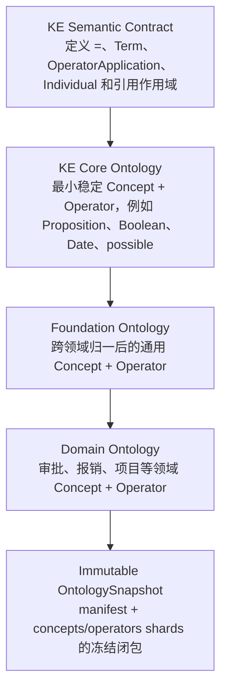
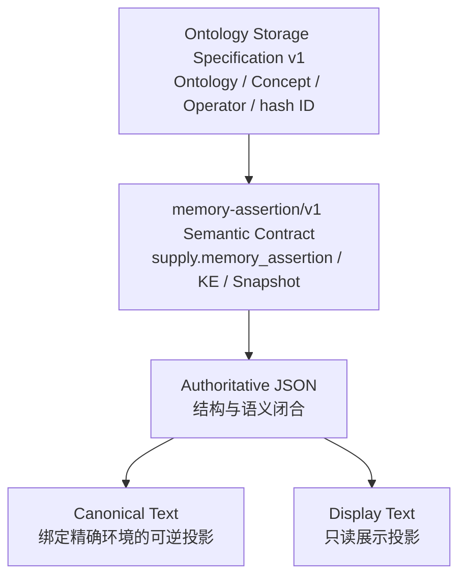

# memory-assertion/v1 规范总览

本目录定义 `memory-assertion/v1` 的唯一活动合同。规范使用“必须”“不得”“可以”表达强制、禁止和允许行为；说明性示例不能覆盖正文和 Schema。

## 适用范围

本 Profile 负责：

- 在上游 `Concept` 与 `Operator` 的 `supply.memory_assertion` 中保存受控扩展；
- 定义真实等式 KE、五类 `LeafTerm`、Canonical Text 和作用域；
- 定义内嵌 Lexicalization、literal contract 与 Operator 解释合同；
- 定义 manifest 加上游互斥分片组成的 `OntologySnapshot`；
- 为后续 NL2KE 和 semantic validator 提供可执行合同。

本 Profile 不负责 Admission、Lifecycle、冲突合并、权威 claim 写入、检索、embedding、L2 抽象或任意规则执行。候选 KE 不因结构合法而成为现实真值。

## 定义层与交付层

下面是语义定义的层次；它不是文件目录或 shard 类型的替代命名：



`KE Semantic Contract` 定义表达语言，不产生本体实体；`KE Core Ontology`、`Foundation Ontology` 和 `Domain Ontology` 都只贡献 `Concept`/`Operator` 记录。三类定义层在运行时不形成三套平行身份，最终统一进入 Snapshot 的 `concepts[]`/`operators[]` 分片，并由来源、版本和 provenance 区分构建归属。`OntologySnapshot` 是不可变交付产物，不是第五种定义本体。

## 权威层级



冲突处理顺序如下：

1. 上游分片结构和 ID 规则优先，Profile 不改写上游字段。
2. Profile 规范与 Profile Schema 必须一致；不允许保留第二份活动合同。
3. Authoritative JSON 是运行时语义载体。
4. Canonical Text 只有在绑定精确 Snapshot 与作用域环境时才可逆。
5. Display Text 不得参与解析、hash 或权威存储。

## 规范组成

| 文档 | 规范责任 |
| --- | --- |
| `normative-vocabulary.md` | 冻结术语、身份层、Term kind 与边界 |
| `ke-semantic-syntax-standard.md` | 定义 equality、KE JSON AST、作用域和 Canonical Text |
| `ontology-standard.md` | 定义 Concept/Operator Profile、Lexicalization 和函数解释合同 |
| `ontology-snapshot-packaging.md` | 定义 manifest、上游分片闭包、hash 与 provisioning 边界 |
| `nl2ke-integration-requirements.md` | 定义 NL2KE 输入、候选输出、Evidence、诊断和测试责任 |
| `foundation-ontology-v1-build-plan.md` | 定义三源归一化、消歧、审计和发布方法 |
| `2026-08-08-memory-assertion-v1-contract-migration-design.md` | 记录本次单一合同迁移、归档边界与验收项 |
| `schema/memory-assertion-ontology-profile.schema.json` | 收紧上游 Concept/Operator 的 Profile 扩展 |
| `schema/memory-assertion-v1.schema.json` | 定义 NL2KE request/response/error/capabilities/readiness 交换合同 |
| `schema/ontology-snapshot-manifest.schema.json` | Snapshot manifest Draft-07 合同 |
| `schema/examples.json` | 可执行正例与反例 |
| `schema/ontology-profile-and-manifest-vectors.json` | Profile、manifest、provisioning 与 JCS 正反向量 |
| `schema/canonical-text-reference-vectors.json` | Canonical Text reference harness 的五类 LeafTerm、环境和 fail-closed 向量 |
| `../../../fixtures/ontology-snapshot-example/` | manifest、三类分片与真实 hash conformance fixture |
| `../../../tools/validate_specifications.py` | 离线结构、向量、hash 与最小闭包验证入口 |
| `../../../tools/canonical_text_reference.py` | 仅用于 conformance 测试的最小 reference parser/renderer；不是生产 parser |

## 统一示例表

| kind | ID | Canonical Symbol |
| --- | --- | --- |
| Ontology | `ontology_9a0634222551` | `MemoryAssertionExample` |
| Concept | `concept_58fa53e5ab6d` | `Entity` |
| Concept | `concept_72c9781aa03b` | `Person` |
| Concept | `concept_32ad50552813` | `Organization` |
| Concept | `concept_fd8836ad6c9c` | `Model` |
| Concept | `concept_b39c9a889cc6` | `Boolean` |
| Concept | `concept_9bdb3283cc8f` | `Date` |
| Concept | `concept_441bafa9e9ed` | `Proposition` |
| Concept | `concept_b809c63d2ee0` | `Quantity` |
| Concept | `concept_400b1a5cb986` | `Decimal` |
| Concept | `concept_35f01a413e72` | `DateTime` |
| Concept | `concept_8b17e273c98f` | `Duration` |
| Concept | `concept_b4bdacfaaec4` | `Money` |
| Concept | `concept_13c81bbb1b78` | `Text` |
| Operator | `operator_fe9dd6d99ebf` | `created_by` |
| Operator | `operator_7e2261ee9c51` | `possible` |
| Operator | `operator_61921190c148` | `event_time` |
| Operator | `operator_0e0ca38b526f` | `believes` |

Operator 签名固定解释为：

```text
created_by(Model, Organization) -> Boolean
possible(Proposition) -> Boolean
event_time(Proposition, Date) -> Boolean
believes(Person, Proposition) -> Boolean
```

## 实现状态用语

- “合同已定义”表示本文档和 Schema 已给出规则。
- “结构校验已实现”要求存在可运行 Draft-07 验证和测试结果。
- “语义校验已实现”要求跨引用、类型、DAG、作用域和 hash 校验器有运行证据。
- “可 round-trip”要求 parser/render 测试覆盖五类 `LeafTerm` 和失败向量。
- “可发布 Snapshot”要求 manifest、全部分片、记录数、摘要与闭包均通过 provisioning 验证。

不得把第一项提升为后四项。
