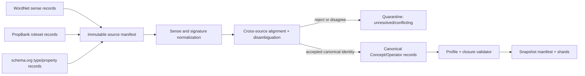

# Foundation Ontology v1 构建方案

本方案定义第一版 Foundation Ontology 如何把 WordNet、PropBank 和 schema.org 的源记录归一为一套无语义交错、可执行的 Canonical Concept/Operator。本方案是构建方法，不是运行时 OntologySnapshot；构建审计产物不得被 NL2KE 读取为第二套本体。

## 1. 目标与硬边界

### 1.1 目标

第一版交付一个满足以下条件的 Snapshot：

- 每个运行时 Concept/Operator 只有一个 Canonical ID；
- 跨源等价语义合并为同一个 Canonical ID，不把同义源记录并排暴露为多个运行时实体；
- 不能安全合并的源记录不进入 Snapshot，而进入 quarantine；
- 每个进入 Snapshot 的 Operator 具有有序 `input_concepts[]`、唯一 `output_concept` 和可执行 Profile 合同；
- 每个进入 Snapshot 的词面都有 owner 内嵌 Lexicalization 和可回溯 provenance；
- 两个实现只读取同一 Snapshot，即可得到相同的 Concept/Operator 身份、签名和 literal 约束。

### 1.2 不做的事

- 不建立全局 `Role`、`CoreRole` 或 role hierarchy；
- 不把 PropBank ARG0/ARG1/function tag 直接提升为本体身份；
- 不把 WordNet synset、PropBank roleset、schema.org type 自动当作三个平行 Canonical Concept；
- 不把运行时 Individual、Evidence、Admission、Lifecycle、L2 或评测 gold 放入 Foundation Snapshot；
- 不用字符串相似度直接决定跨源合并。

## 2. 输入与构建产物



### 2.1 源记录

每条输入记录必须保留 source kind、source version、source-native identity、原始 lemma/label、定义文本、层级边和 provenance。WordNet lexicalization 必须带 `sense_id`；PropBank lexicalization 必须带 `roleset_id`。没有精确 sense/roleset 的记录不得伪装成这两类来源。

每个输入来源还必须具有独立 SHA-256；版本名和路径不能替代内容摘要。最终 `source_manifest[]` 保存该摘要，以保证同一构建决策可复现。

### 2.2 构建审计产物

构建期间可以生成：

- `SourceMapping`：源记录到 Canonical ID 的决策记录；
- `CrosswalkDecision`：候选对齐、证据、规则版本、提案与复核结果；
- `QuarantineRecord`：未解决或冲突项及拒绝原因；
- `BuildManifest`：输入版本、代码/规则 hash、输出 shard hash。
- `IdentitySeedRegistry`：按上游规范永久保存每个 Ontology/Concept/Operator 的 UUIDv4 身份种子与所得 hash ID；该注册表不得发布为运行时本体字段。

这些文件只用于审计、重建和人工排查，不进入运行时 Snapshot 的 `concepts[]`、`operators[]` 或 KE。

## 3. Canonical identity policy

### 3.1 身份决定规则

1. 先按 source-native sense/roleset 切分语义，不按 lemma 合并。
2. 对每个候选语义建立语言无关的 Canonical definition、semantic kind 和层级位置。
3. 只有定义、外延、签名和约束均兼容的候选才能共用 Canonical ID。
4. `exact` 只表示外部实体与 Canonical identity 的等价映射；`narrow`、`broad`、`related` 不得触发合并。
5. 任何合并都必须通过 disjointness、parent DAG、Operator arity、input/output Concept 和 literal codec 检查。

### 3.2 来源优先级不是语义替代

来源优先级只用于冲突裁决和 provenance，不表示某一来源天然拥有所有语义：

```text
source-asserted exact/equivalent
    > identity-level exact sense/roleset alignment
    > independently verified definition + signature alignment
    > lexical similarity only (永不自动接受)
```

schema.org 自己声明的 `equivalentClass` 等价关系可以作为 `source_asserted` 证据；WordNet 与 schema.org 仅同名、PropBank 与 WordNet 仅同 lemma 时，不得直接合并。

## 4. 自动对齐与消歧流程

### 4.1 候选生成

为每个 source-native item 生成有限候选集：

- 规范化后的多语言 lexicalization；
- source-asserted equivalent/exact links；
- WordNet hypernym 与 schema.org subclass 祖先；
- PropBank roleset 的定义、frame 与参数数目；
- 已有 Canonical Concept 的允许/禁止类型关系；
- Operator 的有序输入 Concept、唯一输出 Concept、`proposition_operation` 和 function semantics。

候选生成只能增加候选，不能直接改变 Canonical ID。

### 4.2 自动“双通道”晋升

v1 采用机器化双通道审批，不把“模型自己写 `human_reviewed`”当作人工复核：

1. **Proposal pass**：根据 source assertions、定义、层级和签名生成唯一候选对齐及证据包。
2. **Independent verification pass**：使用独立提示、独立排序或独立实现重新判断候选；不得读取 Proposal pass 的最终标签，只读取冻结输入和候选证据。
3. **Deterministic gate**：程序检查候选是否满足 ID、类型、DAG、签名、disjointness、来源条件和版本闭合。
4. 两个通道均接受且 gate 全通过，才写入 `accepted`；任何不一致、缺证据或无法判定均写入 quarantine。

这套流程自动完成可证明的归一化，但不把不可判定的语义伪装成已合并。自动化的正确结果可以是“排除该源项”，而不是在 Snapshot 中保留两个互相重叠的身份。

### 4.3 WordNet sense 消歧

WordNet lemma 多义时必须按 synset/sense 处理。NL2KE 运行时只读取已经进入 Snapshot 的 Canonical lexicalization；未选中的 sense 不作为隐含候选注入。构建阶段无法确定某个 sense 的 Canonical definition 时，保留在 quarantine，并记录缺口，不随机选 offset。

### 4.4 PropBank roleset 归一

每个 roleset 独立处理；同一 lemma 的不同 roleset 不得共用 Operator ID，除非独立审查同时确认 `semantic_definition` 与外延等价，并确认有序输入 Concept、局部参数语义、唯一输出 Concept、`proposition_operation` 和 function semantics 的完整签名一致。结构签名相同只是必要条件，不是共享 Canonical ID 的充分条件。ARG 编号不携带全局语义，function tag 只能作为候选证据和 provenance。

接受后的运行时 Operator 形态为：

```text
input_concepts[] -> output_concept
```

`positional_parameters[n]` 是 Operator-local 名称和定义说明，不创建 Role 身份。源 ARG0/ARG1、function tag 和 roleset id 留在构建审计记录及 Lexicalization 的 `source_attestations` 中。

### 4.5 schema.org 对齐

schema.org `subClassOf`、`domainIncludes`、`rangeIncludes` 和 source-asserted `equivalentClass` 进入候选生成与约束检查。仅名称相同不构成 exact mapping。若 schema.org type 与 WordNet Concept 语义兼容但证据不足，保持单一 Canonical authority 选择；另一源记录记录为 `ExternalMapping` 或 quarantine，不生成平行运行时 Concept。

## 5. Foundation v1 最小内容

第一版先覆盖能支撑 `memory-assertion/v1` 和 NL2KE conformance 的稳定语义：

- Core concepts：至少包括 `Entity`、`Proposition`、`Event`、`State`，以及 `Boolean`、`Text`、`Decimal`、`Date`、`DateTime`、`Duration`、`Money`、`Quantity` 等 v1 使用的 literal concepts；
- Foundation concepts：经 sense-level 消歧的 Person、Organization、Model 等通用实体概念；
- Foundation operators：经过 roleset-level 消歧、具有完整输入/输出签名的常用关系与函数；
- 每个 Literal concept 的闭合 codec；
- 中英文一等 lexicalization，以及 WordNet/PropBank/schema.org/human/domain_corpus 来源 attestations。

不要以“把所有源词条都塞进去”作为 v1 完成标准。覆盖率由私有 gold 和 quarantine 统计独立报告。

所有 `memory-assertion/v1` runtime Snapshot 只接受 `partiality=total` 的 Operator。`partial` 结构虽然由 Profile Schema 保留用于前向合同和构建审计，但在 v1 没有内容寻址、随 Snapshot 闭包交付的 Operator-specific definedness registry；因此任何 `partial` Operator 都必须进入 quarantine，不能因 `required_capabilities[]` 或自然语言条件而发布。

## 6. 构建顺序与确定性

1. 固定 source manifest 和输入文件 hash；
2. NFC 规范化 source strings，解析 source-native identity；
3. 生成候选 definitions、hierarchy、lexicalization 和 signatures；
4. 执行 Proposal pass、Independent verification pass 和 deterministic gate；
5. 对新身份使用 CSPRNG 生成 UUIDv4 并立即持久化到 `IdentitySeedRegistry`；已有身份必须复用已保存 seed；按上游 `kind:<uuid>` SHA-256 算法生成 canonical IDs，再生成 symbols、parents、external mappings 和 owner lexicalizations；
6. 按稳定键排序分片记录并计算 artifact hash；
7. 构建 Snapshot manifest，计算 root hash；
8. 运行上游 Schema、Profile Schema 和 semantic closure validator；
9. 只将完整闭包发布到不可变缓存。

同一输入 manifest、同一已持久化 `IdentitySeedRegistry`、规则版本和构建器版本必须产生相同的 Canonical ID 映射、分片顺序和 Snapshot hash。仅有相同来源文件但缺失原 seed registry 时，不允许重新随机生成 seed 后声称重建了原身份。名称/词面修订只产生新的 Snapshot hash；语义定义变化必须产生新 Canonical ID，并以 `deprecated/replaced_by` 连接旧身份。

## 7. 验收指标

构建报告必须分别给出：

- source ingestion completeness；
- accepted Canonical Concept/Operator count；
- quarantine count 和每类原因；
- duplicate semantic identity rate；
- false merge rate（独立 gold）；
- Concept parent DAG 与 Operator signature closure；
- lexicalization coverage（按语言、source kind、resolved/candidate）；
- 同一 source manifest 重建的 byte/hash reproducibility。

任何一项缺少独立证据时，报告 `unknown`，不填充估计值。Foundation Ontology v1 通过本方案完成“构建合同”并不表示当前数据已经构建完成。
