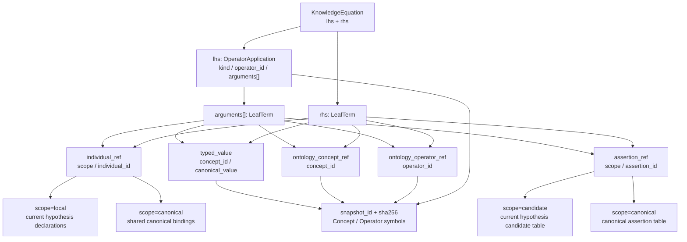
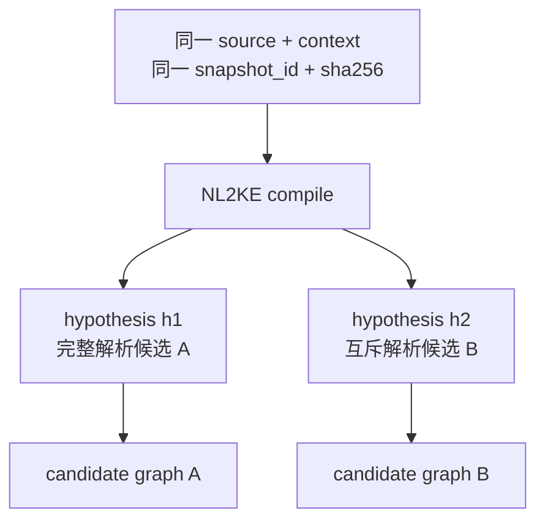

# KE 语义与语法标准

本标准定义 `memory-assertion/v1` 的 Knowledge Equation、JSON AST、many-sorted equality、作用域和 Canonical Text。Authoritative JSON 是权威语义载体；Canonical Text 是绑定精确环境的确定性可逆投影。

## 1. 核心模型

```text
KnowledgeEquation := OperatorApplication "=" LeafTerm

OperatorApplication := operator_id + ordered arguments[]

LeafTerm :=
  individual_ref
  | typed_value
  | assertion_ref
  | ontology_concept_ref
  | ontology_operator_ref
```

`OperatorApplication` 是复合 Term，不是 `LeafTerm`。`arguments[]` 的每一项和 `rhs` 都必须是五类 `LeafTerm` 之一；本 Profile 不允许把另一个 `OperatorApplication` 直接嵌入 arguments 或 rhs。命题组合通过显式 `assertion_ref` 形成 candidate graph。

## 2. JSON AST

### 2.1 KnowledgeEquation

KnowledgeEquation 恰好包含：

| 字段 | 结构 | 约束 |
| --- | --- | --- |
| `lhs` | `OperatorApplication` | 必须存在 |
| `rhs` | `LeafTerm` | 必须存在且与 Operator 的 `output_concept` 兼容 |

`created_by` 的 Authoritative JSON 示例：

```json
{
  "lhs": {
    "kind": "operator_application",
    "operator_id": "operator_fe9dd6d99ebf",
    "arguments": [
      {
        "kind": "individual_ref",
        "scope": "canonical",
        "individual_id": "model-gpt-4"
      },
      {
        "kind": "individual_ref",
        "scope": "canonical",
        "individual_id": "openai"
      }
    ]
  },
  "rhs": {
    "kind": "typed_value",
    "concept_id": "concept_b39c9a889cc6",
    "canonical_value": true
  }
}
```

在绑定本标准统一示例 Snapshot 与 individual bindings 后，其 Canonical Text 是：

```text
created_by(Model__gpt_4,Organization__openai)=Boolean::true
```

### 2.2 OperatorApplication

| 字段 | 约束 |
| --- | --- |
| `kind` | 恒为 `operator_application` |
| `operator_id` | 必须指向精确 Snapshot 中存在的 Operator hash ID |
| `arguments[]` | 有序；长度必须等于 `input_concepts[]` 长度 |

`arguments[n]` 必须与 `input_concepts[n]` 类型兼容。rhs 必须与 `output_concept` 类型兼容。类型兼容需要 semantic validator 结合 Concept 继承 DAG 与不相交约束判断，不能只靠 JSON Schema 判断。

### 2.3 LeafTerm

| `kind` | JSON 字段 | Canonical Text 例子 |
| --- | --- | --- |
| `individual_ref` | `scope`, `individual_id` | `Model__gpt_4` |
| `typed_value` | `concept_id`, `canonical_value` | `Date::"2026-08-09"`、`Boolean::true` |
| `assertion_ref` | `scope`, `assertion_id` | `Assertion::candidate::"created-by-1"` |
| `ontology_concept_ref` | `concept_id` | `Concept::Person` |
| `ontology_operator_ref` | `operator_id` | `Operator::created_by` |

`typed_value.canonical_value` 不得为 `null`，并必须通过对应 Concept 的 `literal_value_contract`。该 Concept 是类型身份；不得另建顶层 ValueType 身份。

## 3. AST 与作用域



作用域规则：

- `individual_ref.scope=local` 只解析当前 hypothesis 的 local declarations；
- `individual_ref.scope=canonical` 只解析共享 canonical bindings；
- `assertion_ref.scope=candidate` 只解析当前 hypothesis 的 candidate assertion ID table；
- `assertion_ref.scope=canonical` 只解析共享 canonical assertion ID table；
- `ontology_concept_ref`、`ontology_operator_ref`、OperatorApplication 和 typed value 只解析精确 `snapshot_id + sha256`；
- 默认禁止跨 hypothesis candidate 引用；禁止 assertion self-reference 和 candidate graph 循环；
- 任何 ID 缺失、碰撞、跨域或类型不兼容都必须 fail-closed。

## 4. Equality 语义

`=` 是 many-sorted equality，不是赋值、箭头、designated-output 绑定或事实接纳。对同一 hypothesis、同一 Snapshot 和类型兼容的 Term，解释器至少必须尊重：

```text
reflexivity
symmetry
transitivity
congruence
scope-bounded substitution
```

Profile 为获得唯一序列化，只保存 `OperatorApplication = LeafTerm`。因此：

- equality 的对称性不要求保存反向 JSON；
- JSON `lhs/rhs` 顺序是规范方向，不削弱 equality 语义；
- 不得输出或保存裸 `LeafTerm = LeafTerm`；
- congruence 只在声明的 Operator 解释和兼容类型内成立，不推出 Concept extensionality 或 Operator function extensionality；
- substitution 不得越过 hypothesis、Snapshot、引用 scope 或不兼容 Concept；
- equality 不执行 Admission，不判断来源忠实度，也不把 candidate 变成现实真值。

关系型事实必须用 Boolean predicate 补全。例如 `created_by` 把关系参与项都放入输入，并输出 `Boolean`：

```text
created_by(Model__gpt_4,Organization__openai)=Boolean::true
```

以下裸等式无效：

```text
Model__gpt_4=Organization__openai
```

## 5. 命题引用

命题修饰、态度和命题关系必须显式接受 `AssertionRef`。统一示例 Operator 的 Canonical Text 为：

```text
possible(Assertion::candidate::"created-by-1")=Boolean::true
event_time(Assertion::candidate::"created-by-1",Date::"2026-08-09")=Boolean::true
believes(Person__alice,Assertion::candidate::"created-by-1")=Boolean::true
```

AssertionRef ID 必须使用 JSON string。这里的 `"created-by-1"` 不是省略写法；引号与 JSON escaping 是 Canonical Text 的组成部分。

Candidate graph 必须满足：

- 每个 root ID 指向当前 hypothesis 内存在的 candidate；
- 每个 non-root candidate 从至少一个 root 经 `assertion_ref` 可达；
- 禁止孤立 candidate、自引用和循环；
- 同一 embedded candidate 可以被多个上层 candidate 引用；
- 若 embedded candidate 也被来源独立陈述，它必须同时列为 root；
- root 只表示图入口，不表示可信、正确或已 Admission。

### 5.1 Hypothesis 的语义边界

一个 response 中的多个 `hypotheses[]` 是对同一组输入与同一 OntologySnapshot 的**互斥解析候选**。每个 hypothesis 都有自己的 local declarations、candidate assertion ID table、candidate graph 和 `root_candidate_ids[]`；调用方不得把不同 hypothesis 的 candidate 合并成一个图。



这里的“互斥”表示这些 hypothesis 不能同时作为同一次解析结果成立，不表示它们已经构成现实事实冲突。事实冲突要求比较具有权威身份、时间、来源和生命周期状态的记忆记录；该判断不属于 Hypothesis Contract。

NL2KE 只编译本次请求指定的 source，并可用 context 消歧和闭合引用。即使 context 来自其他 turn，NL2KE 也不得据此执行跨 turn 的 conflict detection、merge、supersession、Admission 或 lifecycle 更新。这些操作由记忆系统在候选输出之后负责。

### 5.2 v1 不支持的命题构造

`memory-assertion/v1` 不提供变量环境、量词作用域或命题 connective，因此下列构造不能编译为合法 KE：

| 来源语义 | `unsupported_construct.payload.construct` | v1 边界 |
| --- | --- | --- |
| 全称量词、存在量词或其他量词作用域 | `quantifier` | 不支持 quantifier scope |
| 变量声明、变量引用或变量绑定 | `variable_binding` | 不支持变量环境 |
| `AND`、`OR` | `logical_connective` | 不支持构造合取或析取 Proposition |
| `IF`、条件前件与后件 | `conditional` | 不支持条件 Proposition |

遇到这些构造时，NL2KE 必须在 `reported_capability_gaps[]` 返回 `code=unsupported_construct`，不得将其报告为 `reported_ontology_gaps`，也不得临时创建 Operator 模拟支持。需要该构造才能闭合的 candidate 必须省略；若还有独立且完整的合法 KE，可以返回 `status=compiled`，否则应按响应合同返回 `status=abstained`。

同一 hypothesis 中存在多个 root，只表示来源直接表达了多个顶层候选断言；`root_candidate_ids[]` 不是 `AND` 构造器，也不能生成一个可被 `AssertionRef` 引用的合取 Proposition。

## 6. Canonical Text

### 6.1 语法

```text
KnowledgeEquation    = OperatorApplication "=" LeafTerm
OperatorApplication  = OperatorSymbol "(" [LeafTerm *( "," LeafTerm )] ")"
LeafTerm             = IndividualRef / TypedValue / AssertionRef / OntologyConceptRef / OntologyOperatorRef
IndividualRef        = NamingConceptSymbol "__" IndividualLocalSymbol
TypedValue           = ConceptSymbol "::" JcsJsonValue
AssertionRef          = "Assertion::" AssertionScope "::" JsonString
AssertionScope        = "candidate" / "canonical"
OntologyConceptRef   = "Concept::" ConceptSymbol
OntologyOperatorRef  = "Operator::" OperatorSymbol
```

Canonical Text 不插入可选空格。`OperatorSymbol` 与 `ConceptSymbol` 分别来自 Snapshot 内对应对象的 `canonical_name`。Individual symbol 由 `naming_concept_id` 对应的 Concept Symbol、两个下划线和 `local_symbol` 组成。

`JcsJsonValue` 是不含 `null` 的 JSON value：JSON string、Boolean、number、object 或 array。字符串必须使用 JSON escaping；object key 顺序按 JCS；数字必须使用对应 literal codec 允许的规范表示。v1 的 typed value 仍须先通过所属 Concept 的 literal contract，Canonical Text 语法本身不放宽 codec 约束。

### 6.2 Individual binding 环境

Local declaration 与 canonical binding 都必须提供：

```json
{
  "individual_id": "model-gpt-4",
  "local_symbol": "gpt_4",
  "naming_concept_id": "concept_fd8836ad6c9c",
  "concept_ids": ["concept_fd8836ad6c9c"]
}
```

`local_symbol` 必须匹配 `^[a-z][a-z0-9_]*$`；`naming_concept_id` 必须存在于 `concept_ids[]`，并解析到精确 Snapshot。一个闭合 hypothesis bundle 中，展开后的 local/canonical Individual symbol 必须全局唯一；碰撞时拒绝。

### 6.3 Round-trip 环境

parse 与 render 必须绑定：

```text
snapshot_id + sha256
current hypothesis local declarations
shared canonical bindings
candidate assertion ID table
canonical assertion ID table
```

并满足：

```text
parse(render(authoritative_knowledge_equation_json, environment), environment)
  = canonicalize(authoritative_knowledge_equation_json)
```

这里的输入对象严格限定为一条已经语义闭合的 `KnowledgeEquation` JSON AST，不包括 Candidate metadata、EvidenceSpan、Hypothesis 或整个 NL2KE response。Snapshot、Symbol、binding、AssertionRef、arity、Concept 类型或 literal codec 任一不匹配时必须 fail-closed。Display Text 可以改写或本地化，但不得进入此等式。

## 7. 正反例

合法：

```text
created_by(Model__gpt_4,Organization__openai)=Boolean::true
possible(Assertion::candidate::"created-by-1")=Boolean::true
event_time(Assertion::candidate::"created-by-1",Date::"2026-08-09")=Boolean::true
believes(Person__alice,Assertion::candidate::"created-by-1")=Boolean::true
```

非法：

```text
Model__gpt_4=Organization__openai
created_by(Model__gpt_4,Organization__openai)=true
possible(created-by-1)=Boolean::true
possible(Assertion::candidate::created-by-1)=Boolean::true
created_by(Model__gpt_4)=Boolean::true
```

非法原因依次是：裸叶项等式、缺失 typed value Concept、缺失 AssertionRef 构造器、AssertionRef ID 不是 JSON string、Operator arity 不匹配。

## 8. 统一示例映射

| ID | Canonical Symbol | 签名 |
| --- | --- | --- |
| `operator_fe9dd6d99ebf` | `created_by` | `Model, Organization -> Boolean` |
| `operator_7e2261ee9c51` | `possible` | `Proposition -> Boolean` |
| `operator_61921190c148` | `event_time` | `Proposition, Date -> Boolean` |
| `operator_0e0ca38b526f` | `believes` | `Person, Proposition -> Boolean` |

Concept ID：`Person=concept_72c9781aa03b`、`Organization=concept_32ad50552813`、`Model=concept_fd8836ad6c9c`、`Boolean=concept_b39c9a889cc6`、`Date=concept_9bdb3283cc8f`、`Proposition=concept_441bafa9e9ed`。

本标准定义合同，不证明 parser、renderer、semantic validator 或 candidate graph validator 已经实现。
