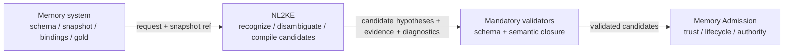
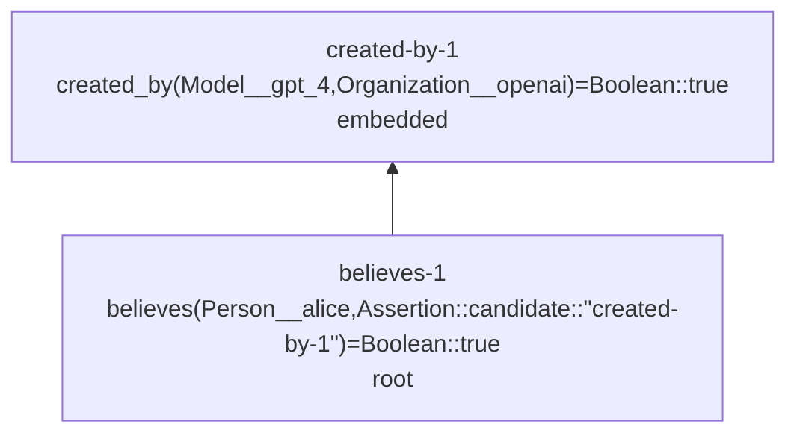

# NL2KE 对接要求

本文档定义外部 NL2KE 服务在 `memory-assertion/v1` 下必须满足的输入、输出、能力和测试合同。NL2KE 是无状态的候选编译器，不是记忆事实权威。

## 第一部分：关键决策

### 1. 一句话合同

```text
自然语言 Source + Context + ClosedHypothesisBundle + OntologySnapshotRef
    -> 0..N 个语义 hypothesis
    -> 每个 hypothesis 含 1..N 个原子 CandidateAssertion
```

NL2KE 必须输出语法合法、Snapshot 可校验、证据可回放的候选 KE。候选不得因为结构合法而被描述为真实、已接受或已经进入记忆。

### 2. 三层正确性

| 层 | 是否硬要求 | 谁验证 |
| --- | --- | --- |
| JSON/协议结构正确 | 必须 | NL2KE 最终 validator + 调用方 |
| 本体与 KE 语义闭合 | 必须 | NL2KE 最终 validator + memory semantic validator |
| 忠实表达原文 | 质量目标，不盲信自评 | memory 私有 gold、人工/独立 evaluator |

NL2KE 不能可靠声明“没有漏掉任何知识”，因此不得返回 `source_coverage` 或 `ontology_coverage`。生产环境没有 gold 时，这两项是未知，不得用字符 Evidence 覆盖率替代语义覆盖率。

### 3. 职责边界



Memory system 负责：

- KE Schema、Ontology Profile、Snapshot 构建/预分发和 Canonical ID；
- raw message revision、canonical bindings、历史 canonical assertion table；
- Admission、trust、utility、conflict、Lifecycle、L1/L2 和权威持久化；
- 私有 semantic gold、source/ontology coverage 和最终质量结论。

NL2KE 负责：

- 读取精确 Snapshot 缓存；
- 从 source/context 识别词面并按上下文、类型和 Operator 签名消歧；
- 把可闭合语义编译为原子 CandidateAssertion；
- 返回 EvidenceSpan 引用、处理范围和封闭诊断；
- 无法闭合时 abstain 或只输出可闭合部分。

NL2KE 不得：

- 创建或修改 Canonical Concept/Operator ID；
- 临时访问网络补全指定 Snapshot；
- 输出 unresolved placeholder、悬空引用或循环 candidate graph；
- 执行 Admission 或声明 candidate 为真实/权威；
- 把 candidate lexicalization 单独当作最终语义选择依据。

## 第二部分：请求合同

### 4. 服务端点与 HTTP 合同

数据面只定义一个编译端点：

| 方法与路径 | 成功响应 | 失败响应 | 作用 |
| --- | --- | --- | --- |
| `POST /v1/compile` | HTTP 200 `Nl2KeResponse` | HTTP 4xx/5xx `Nl2KeError` | 执行一次无状态候选编译 |
| `GET /v1/capabilities` | HTTP 200 capabilities document | HTTP 503 `Nl2KeError` | 在发送请求前协商 Profile、codec 和校验能力 |
| `GET /v1/ready` | HTTP 200 readiness document | HTTP 503 `Nl2KeError` | 检查编译器、Schema validator、semantic validator 与 Snapshot cache 子系统是否可用 |

`POST /v1/compile` 的 request body 必须通过 `Nl2KeRequest`，HTTP 200 body 必须通过 `Nl2KeResponse`。HTTP error body 必须通过同一交换 Schema 中封闭的 `Nl2KeError`，不得临时改用 `status_code`、`error_type` 或开放 `details`。Capabilities 与 readiness body 也分别由同一 Schema 的 `Nl2KeCapabilities`、`Nl2KeReadiness` 分支校验，不存在第二套未校验 JSON。

Capabilities 最小响应形状固定为：

```json
{
  "document_kind": "nl2ke_capabilities",
  "protocol_version": "nl-to-ke/v1",
  "semantic_contract_versions": ["memory-assertion/v1"],
  "ontology_schema_ids": [
    "https://genuineknowledge.com/specifications/ontology/v1/ontology.specification.json"
  ],
  "literal_codec_ids": [
    "ke-literal:boolean/v1",
    "ke-literal:text-nfc/v1",
    "ke-literal:decimal/v1",
    "ke-literal:date/v1",
    "ke-literal:datetime/v1",
    "ke-literal:duration/v1",
    "ke-literal:money/v1",
    "ke-literal:quantity/v1"
  ],
  "snapshot_delivery": "preprovisioned_immutable_cache",
  "final_validation": "mandatory"
}
```

Readiness 最小响应形状固定为：

```json
{
  "document_kind": "nl2ke_readiness",
  "protocol_version": "nl-to-ke/v1",
  "ready": true,
  "checks": {
    "compiler": true,
    "schema_validator": true,
    "semantic_validator": true,
    "snapshot_cache": true
  }
}
```

`ready=true` 只表示服务子系统可接受请求，不表示某个 `snapshot_id+sha256` 已缓存，也不表示语义质量达标。精确 Snapshot 是否存在仍在 compile 前 fail-closed 校验。

### 5. Snapshot 引用

单次请求只携带：

```json
{
  "ontology_snapshot_ref": {
    "snapshot_id": "memory-assertion-example-v1",
    "sha256": "6163b7f30ed60650d3f4361d3a8368c3901619e92d25114bb4667339e1286787"
  }
}
```

Snapshot 必须在请求前预分发到 NL2KE 的本地不可变缓存。缓存缺失、hash 不匹配、Schema/闭包失败或 required capability 不支持时返回 HTTP error；不得自动降级到其他 Snapshot，也不得在请求中内联完整 Snapshot。

### 6. Source 与 Context

NL2KE 只看到两个文本区域：

| 区域 | 用途 |
| --- | --- |
| `source.messages[]` | 当前待编译文本；`focus_message_ids[]` 指定本次目标 |
| `context.items[]` | 只用于指代、时间、实体和命题作用域消歧 |

NL2KE 不需要理解 memory 内部的 turn/session/summary/lifecycle 层级。每条 source message 必须包含稳定 `message_id`、`message_revision_id`、`content`、`content_sha256`、role、顺序和语言。Evidence offsets 只对精确 revision 有效。

Context 只能支持解析，不得被偷换为 source 直接陈述。若 Candidate 依赖 context，使用 `support_basis=context_resolved` 并返回非空 `context_support_refs[]`。

### 7. ClosedHypothesisBundle

请求可以提供：

- `canonical_bindings[]`：调用方声明的权威 Individual identity、`local_symbol`、`naming_concept_id` 和 `concept_ids[]`；
- `canonical_assertions[]`：允许 `assertion_ref.scope=canonical` 引用的历史权威 claim；
- `local_declarations[]`：本次请求已知的 hypothesis-local identity；
- 所有 ID table 都必须闭合并与精确 Snapshot 一致。

NL2KE 可以新增 hypothesis-local Individual declaration，但不得创建新的 canonical Individual identity。

### 8. Execution 控制

调用方可以控制 model、route、credential reference、budget 和 strategy。NL2KE 必须回显实际使用配置；不得暴露原始密钥或内部实现代码。

```json
{
  "execution": {
    "model": {
      "provider": "openai-compatible-provider",
      "model_id": "model-id",
      "route_id": null
    },
    "credential": {
      "mode": "caller_managed",
      "credential_ref": "secret://tenant/nl2ke",
      "credential_ref_fingerprint": "97f9fe1fe0c76702674409e768dd69316d4299fb8db82f0971ab72eee615ce88"
    },
    "budget": {
      "max_model_calls": 2,
      "max_input_tokens": 120000,
      "max_output_tokens": 16000,
      "deadline_ms": 60000
    },
    "strategy": {
      "strategy_id": "nl2ke-standard",
      "strategy_version": "1"
    }
  }
}
```

最终结构校验不可关闭。调用方不接受由 NL2KE 服务方托管的业务 key；计费不属于本版合同。

#### 8.1 交换摘要合同

所有摘要均输出为 64 位小写十六进制。交换摘要和 Snapshot 摘要是两套不同 preimage，禁止混算：

| 字段 | 产生/校验方 | 精确 preimage 与算法 |
| --- | --- | --- |
| `content_sha256` | 调用方产生，双方校验 | 原始 `content` 的精确 UTF-8 字节；不做 NFC |
| `quote_sha256` | NL2KE 产生，双方校验 | Evidence `quote` 的精确 UTF-8 字节；不做 NFC |
| `binding_sha256` | 调用方产生，双方校验 | 删除自身 `binding_sha256` 后的完整 CanonicalBinding；严格 JSON、拒绝重复 key、RFC 8785 JCS、UTF-8、SHA-256 |
| `assertion_sha256` | 调用方产生，双方校验 | 删除自身 `assertion_sha256` 后的完整 CanonicalAssertion；严格 JSON、RFC 8785 JCS、UTF-8、SHA-256 |
| `request_hash` | 双方独立计算，NL2KE 回显 | 深拷贝完整 `Nl2KeRequest`，仅删除 `execution.credential.credential_ref`；保留同一对象中的 caller-owned HMAC `credential_ref_fingerprint`；随后执行严格 JSON、RFC 8785 JCS、UTF-8、SHA-256；不对 source/context 字符串做 NFC |
| `credential_ref_fingerprint` | 调用方产生，NL2KE 原样回显 | 调用方使用自己的 fingerprint key，对精确 `credential_ref` UTF-8 字节执行 HMAC-SHA-256；禁止对低熵引用做裸 SHA-256 |
| `prompt_sha256` | NL2KE 产生并回显 | 本次实际使用的不可变 prompt-template artifact 原始字节 SHA-256；不含动态 source、context、credential 或模型输出 |

`provenance_refs[]` 是调用方或 Snapshot 构建阶段已经验证的 opaque audit locator，不要求 NL2KE 在单次请求中解析其目标，也不参与请求内部引用闭包。它仍然参与所在 binding/assertion 或 Snapshot artifact 的摘要。

所有参与 JCS 的 JSON 都必须先满足 I-JSON 数值与 Unicode 输入域：整数必须位于 `[-9007199254740991, 9007199254740991]`，字符串和对象 key 不得包含未配对 UTF-16 surrogate。Schema 中的非负整数进一步限制为 `0..9007199254740991` 或 `1..9007199254740991`。超界整数、非有限数或未配对 surrogate 必须 fail-closed 为无效交换文档，不能先经 JavaScript Number 舍入后再计算摘要。

删除原始 `credential_ref` 不是取消绑定：`request_hash` 绑定 caller-owned HMAC fingerprint，响应再原样回显该 fingerprint。服务不得把原始低熵引用放入公开可枚举的裸 SHA-256 preimage，也不得自行重算或替换 caller fingerprint。

## 第三部分：输出合同

### 9. CandidateAssertion

```json
{
  "candidate_id": "created-by-1",
  "ke": {
    "lhs": {
      "kind": "operator_application",
      "operator_id": "operator_fe9dd6d99ebf",
      "arguments": [
        {
          "kind": "individual_ref",
          "scope": "canonical",
          "individual_id": "model-gpt-4"
        },
        {
          "kind": "individual_ref",
          "scope": "canonical",
          "individual_id": "openai"
        }
      ]
    },
    "rhs": {
      "kind": "typed_value",
      "concept_id": "concept_b39c9a889cc6",
      "canonical_value": true
    }
  },
  "candidate_metadata": {
    "speech_act": "assertion",
    "epistemic_mode": "self_reported",
    "semantic_assessment": {
      "label": "supported",
      "score": null,
      "score_semantics": "not_provided",
      "uncertainty_codes": [],
      "reasons": []
    }
  },
  "support_basis": "direct_source",
  "source_evidence_ids": ["ev-1"],
  "context_support_refs": []
}
```

约束：

- `candidate_metadata` 整体可选；出现时 `minProperties=1` 且 `additionalProperties=false`；
- `speech_act`、`epistemic_mode`、`semantic_assessment` 均可省略；不支持时不得生成默认值；
- `semantic_assessment.label` 只允许诊断性 `supported|uncertain`；不得出现 `accepted|true|authoritative`；
- `score_semantics=not_provided` 时 `score=null`；其余允许模式下 score 为 0..1；
- `support_basis=direct_source` 时不得依赖未声明 context；`context_resolved` 时 `context_support_refs[]` 必须非空；
- 每条 Candidate 必须至少引用一个顶层 EvidenceSpan。

### 10. Hypothesis 与嵌套命题



`hypotheses[].candidate_assertions` 是唯一候选数组，不保留 `kes` 别名。`root_candidate_ids[]` 表示来源顶层断言，而不是可信或 Admission 状态。

必须满足：

- `root_candidate_ids` 非空且只引用当前 hypothesis candidate；
- 所有 non-root candidate 从至少一个 root 经 candidate `assertion_ref` 可达；
- 禁止孤立 candidate、自引用、循环和默认跨 hypothesis candidate ref；
- 不保存权威 `embedded_candidate_ids`；它由全部 IDs 减 roots 派生；
- 一个 embedded proposition 如果也被原文独立陈述，必须同时列为 root。

### 11. Evidence

响应顶层统一保存：

```json
{
  "evidence_id": "ev-1",
  "message_id": "message-1",
  "message_revision_id": "message-1/rev-1",
  "start_char": 0,
  "end_char": 16,
  "quote": "OpenAI 创建了 GPT-4",
  "quote_sha256": "7c9f94c531ce02699307541f63c19ca6009a0f0a734d24672d8bf665c72b9e91"
}
```

Candidate 只存 `source_evidence_ids[]`。系统不得因为自己保存了 EvidenceSpan 就自动生成“证据支持命题”的领域 KE；只有原文本身明确表达该支持关系时，才可使用 Snapshot 中已有、签名闭合的 Domain Operator 编译。

Evidence 的偏移合同固定为：`start_char` 为闭区间起点，`end_char` 为开区间终点，索引单位是原始 `content` 中的 Unicode scalar value（码点），不是 UTF-16 code unit、字节或 NFC 规范化后的文本。偏移对应的原始子串必须逐码点等于 `quote`；`quote_sha256` 是该 quote 按 UTF-8 编码计算的 SHA-256。`content_sha256` 同样对原始 message content 的 UTF-8 字节计算。消息修订、文本 NFC 形态或 hash 任一不匹配，都必须拒绝 Evidence 闭合，而不是静默调整 offset。

### 12. Status

```text
HTTP 200 + status=compiled
  -> hypotheses 非空
  -> 每个 hypothesis.candidate_assertions 非空
  -> 每个 hypothesis.root_candidate_ids 非空
  -> abstention_reasons 为空

HTTP 200 + status=abstained
  -> hypotheses 为空
  -> abstention_reasons 非空
  -> 不存在 candidate assertion

HTTP 4xx/5xx
  -> 请求、协议、Snapshot、依赖或服务执行失败
```

严格禁止 `status=compiled` 与空 hypotheses 或空 candidate list 同时出现。

#### 12.1 HTTP error envelope

HTTP 4xx/5xx 不返回 `status`，统一返回 `document_kind=nl2ke_error`：

```json
{
  "document_kind": "nl2ke_error",
  "protocol_version": "nl-to-ke/v1",
  "request_id": "request-1",
  "http_status": 409,
  "error": {
    "code": "snapshot_cache_miss",
    "payload": {
      "ontology_snapshot_ref": {
        "snapshot_id": "memory-assertion-example-v1",
        "sha256": "6163b7f30ed60650d3f4361d3a8368c3901619e92d25114bb4667339e1286787"
      }
    }
  }
}
```

| HTTP | `error.code` | 边界 |
| --- | --- | --- |
| 400 | `invalid_request` | JSON parse、重复 key、Schema 或请求语义合同失败；无法解析 ID 时 `request_id=null` |
| 409 | `snapshot_cache_miss` | 精确 `snapshot_id+sha256` 未预分发到本地缓存 |
| 409 | `snapshot_hash_mismatch` | 同名缓存存在但内容 hash 不同 |
| 422 | `snapshot_invalid` | 指定 Snapshot 已命中缓存，但未通过 Schema、artifact hash、root hash 或语义闭包校验 |
| 422 | `unsupported_protocol_or_contract` | 请求声明的 protocol 或 semantic contract 版本不受服务支持；编译尚未开始 |
| 422 | `unsupported_capability` | 服务不实现 Snapshot/Profile 声明的必需能力；编译尚未开始 |
| 502 | `dependency_failure` | 调用方指定的模型提供方或 credential resolver 执行失败 |
| 503 | `service_unavailable` | 编译器、validator 或 cache 子系统未 ready |
| 500 | `internal_error` | 未归类的服务内部失败，payload 只回传非敏感 incident ID |

`reported_ontology_gaps`、`reported_capability_gaps` 和 `unresolved_items` 只用于 HTTP 200 的文本编译结果；不得拿它们包装 provisioning、协议或服务失败。

### 13. 四类诊断

四个响应字段始终存在，值为数组：

```text
reported_ontology_gaps
reported_capability_gaps
unresolved_items
warnings
```

每个诊断使用封闭外壳：

```json
{
  "code": "missing_operator",
  "payload": {
    "evidence_id": "ev-1",
    "surface_form": "双人审批"
  },
  "display_message": "可选的人类说明"
}
```

机器只依赖 `code+payload`。未知 code、未知 payload 字段和开放 `details` 全部拒绝。

#### 13.1 Ontology gaps

```text
missing_concept
missing_operator
incompatible_type
unsupported_literal_codec
unrepresentable_span
```

表示指定 Snapshot 缺少表达资源。

Payload 是封闭的：

| code | 必填 payload 字段 | 说明 |
| --- | --- | --- |
| `missing_concept` | `evidence_id`, `surface_form` | 没有可用 Concept 入口 |
| `missing_operator` | `evidence_id`, `surface_form` | 没有可用 Operator 入口 |
| `incompatible_type` | `evidence_id`, `operator_id`, `location`, `expected_concept_ids`, `actual_concept_ids` | `location` 为 `{side:"input",input_index}` 或 `{side:"output"}` |
| `unsupported_literal_codec` | `evidence_id`, `concept_id`, `required_codec_id` | Snapshot 中没有能够规范化该来源值的兼容 literal contract |
| `unrepresentable_span` | `evidence_id` | 该证据片段无法映射到当前 Snapshot |

每个 payload `additionalProperties=false`。`incompatible_type` 的 `expected_concept_ids` 与 `actual_concept_ids` 都是 Concept ID 数组，不能用自然语言描述替代。

若 Snapshot 已声明 codec，但 NL2KE 不实现该 Profile 要求的 codec/capability，这是 provisioning 或能力协商失败，必须返回 HTTP error；不得伪装成对某段文本的 `reported_ontology_gaps`。

#### 13.2 Capability gaps

```text
unsupported_construct
```

`construct` 允许：`logical_connective|conditional|quantifier|variable_binding|inline_assertion|cyclic_proposition|cross_hypothesis_reference|multi_output_operator|arbitrary_rule`。AND/OR/IF、量词与变量绑定不应伪装成 ontology gap。

`unsupported_construct` 的 payload 必须是：

```json
{
  "evidence_id": "ev-1",
  "construct": "logical_connective"
}
```

#### 13.3 Unresolved

```text
ambiguous_lexical_mapping
unresolved_individual
unresolved_assertion_scope
unresolved_time
unresolved_value
insufficient_context
```

`ambiguous_lexical_mapping.payload.candidate_targets[]` 是异构数组，每项含 `target_kind=concept|operator` 和对应 hash ID，至少两项且 pair 唯一。任何 unresolved 项不得被塞进 KE placeholder。

其余 unresolved payload：

| code | 必填 payload 字段 |
| --- | --- |
| `unresolved_individual` | `evidence_id`, `mention` |
| `unresolved_assertion_scope` | `evidence_id`, `scope_options[]`（`candidate`/`canonical`，至少两项） |
| `unresolved_time` | `evidence_id`, `expression`, `required_anchor_kinds[]` |
| `unresolved_value` | `evidence_id`, `expression`, `expected_concept_ids[]` |
| `insufficient_context` | `evidence_id`, `required_context_kinds[]` |

#### 13.4 Warnings

```text
normalization_applied
model_output_repaired
```

修复后响应仍须重新通过不可关闭的完整结构校验。

Warning payload 也不开放自由字段：

```json
{
  "code": "normalization_applied",
  "payload": {
    "evidence_id": "ev-1",
    "rule_id": "nfc-v1"
  }
}
```

```json
{
  "code": "model_output_repaired",
  "payload": {
    "repair_kind": "json_syntax"
  }
}
```

`abstention_reasons` 使用同一 `code + payload + display_message?` 外壳。`no_compilable_ke` 的 payload 只有封闭的 `cause`：`ontology_gap|capability_gap|semantic_ambiguity|insufficient_context|truncation`；不得使用旧的顶层 `cause` 或 `evidence_ids`。

### 14. Processing scope 与 coverage

NL2KE 可以可靠报告：收到/处理了哪些 focus message、处理字符范围、是否截断、是否触及 candidate 上限、每条 Candidate 引用了哪些 EvidenceSpan。它不能可靠报告自己没有意识到的遗漏。

`processing_scope.processed_ranges[]` 是实际处理范围的权威字段，按 source order、`start_char`、`end_char` 稳定排序。`processed_focus_message_ids[]` 必须由存在至少一个 range 的 focus message 按请求 focus 顺序确定性派生；如果同时返回而与 ranges 不一致，响应无效。`truncated=false` 时 ranges 必须无空洞覆盖全部 focus message；所有 EvidenceSpan 必须完整落在某个 processed range 内。

真实 source coverage 和 ontology coverage 由 memory 侧对照私有 gold 计算：

```text
evaluated_source_coverage
  = matched gold atomic semantics / all gold atomic semantics

evaluated_ontology_coverage
  = gold semantics expressible by Snapshot / all gold semantics
```

这些评测结果单独存储，不进入生产 NL2KE response。

## 第四部分：测试与合作方式

### 15. 我们向 NL2KE 提供的资源

| 资源 | 是否公开给提供方 | 用途 |
| --- | --- | --- |
| KE/Request/Response JSON Schema | 是 | 协议 conformance |
| Snapshot manifest 与已预分发分片 | 是 | 本体约束和 lexical index |
| Canonical Text 正反例 | 是 | parser/render 对齐 |
| Public development source/context cases | 是 | 联调与错误定位 |
| Selected semantic examples | 是 | 说明多 KE、root/embedded、gap/abstain |
| Private gold atomic semantics | 否 | 独立测 semantic precision/recall |
| Private Evidence gold/forbidden semantics | 否 | 防止针对答案调参 |
| Evaluator/scorer internal policy | 否 | 保持独立验收 |

BEAM、LoCoMo、LongMemEval 等自然 memory benchmark 只用于抽取真实 Source/Context 分布与难例，不能直接充当 NL2KE gold。WordNet、PropBank 和 schema.org 是本体构建来源，既不是测试集，也不能替代完整 OntologySnapshot。

memory 侧为每个 NL2KE 样本维护以下私有标注：

1. 原文中的 gold 原子语义清单，使用可审核自然语言/结构化 checklist；
2. 每个原子语义在精确 Snapshot 下的 `expressible|not_expressible|profile_unsupported`；
3. 精确 `message_revision_id + start_char + end_char + quote` Evidence；
4. root/embedded 身份和嵌套作用域；
5. 可接受的等价解析、互斥 alternatives 与允许的 hypothesis 数；
6. 应当 abstain、报告 ontology gap、capability gap 或 unresolved 的条件；
7. 不得输出的 unsupported/幻觉语义。

不要求人工为每条自然样本书写完整 gold KE，也不把完整 private gold KE 交给提供方。完整 KE 只需用于少量公开 conformance 示例，帮助双方校准 JSON、Canonical Text 和图不变量。这样既降低标注成本，又避免提供方针对隐藏答案调参。

| 分区 | 提供方可见内容 | 用途 |
| --- | --- | --- |
| public conformance | Schema、Snapshot fixture、正反 JSON/Canonical Text、少量完整 KE | 接口与 validator 联调 |
| public dev | source/context、部分 checklist、诊断类别和可接受示例；不含 hidden case | 语义调试与误差分析 |
| private hidden | source/context 仅在受控评测时输入；gold checklist/Evidence/alternatives/forbidden 全部 memory 侧保管 | 独立验收与版本回归 |

建议采用递增样本梯度，而不是一次标大集：

| 阶段 | 建议规模 | 双审人工口径 |
| --- | ---: | ---: |
| conformance smoke | 30..50 个手工构造 case | 10..25 人时 |
| public dev | 100..200 个自然样本 | 30..100 人时 |
| private hidden pilot | 300..500 个自然样本 | 95..260 人时 |
| release hidden | 1000..2000 个分层样本 | 320..1040 人时 |

工时按两名标注者独立完成 checklist、Evidence、root/embedded 和 expressibility，再裁决分歧估算：简单样本约 18..25 人分钟，复杂嵌套/歧义样本约 40..60 人分钟。上表是容量规划区间，不是报价；应先用 30..50 条 pilot 记录真实每样本工时，再外推。若要求完整 gold KE，工时需单独测量，不能沿用该区间。

### 16. 服务挡位与测试层级

对提供方的要求分三挡递进，高挡必须包含低挡，且任何挡位都不能关闭最终结构校验：

| 挡位 | 输入与必须输出 | 验收重点 | 可用边界 |
| --- | --- | --- | --- |
| 1：结构编译 | 原始单轮文本，可附 context；返回 Schema 合法、可解析的 0..N CandidateAssertion 或合法 abstain | JSON/状态不变量 100%；只引用 Snapshot ID；无悬空 Term、非法 ID 或开放字段 | 仅接口 bring-up；内容可能偏差，不得写入 Admission |
| 2：语义闭合与证据 | 单轮、多轮上下文、跨轮/session 摘要作为普通 Source/Context；原子化多 KE | Snapshot typing/arity/literal 100%；Evidence revision/offset/hash 闭合；root/embedded DAG；gap/unresolved/abstain 分界 | 可进入 memory 侧候选验证，不代表语义忠实 |
| 3：语义忠实、歧义与稳定性 | 自然 benchmark 分布、改写、对抗歧义、长 context、hidden set | 私有 gold precision/recall、Evidence exactness、root/embedded、acceptable alternatives、abstention、metamorphic consistency | 达到预注册 hidden gate 后才是受控集成候选；Admission 仍由 memory 决定 |

首轮建议的挡位 3 质量门是：semantic precision `>=0.90`、semantic recall `>=0.85`、Evidence exactness `>=0.95`、root/embedded correctness `>=0.95`、abstention macro-F1 `>=0.85`、metamorphic consistency `>=0.95`，且 unsupported canonical ID 为 0。它们是合作验收起点，不属于 KE 语言语义；正式 hidden 运行前应根据 public dev 难度共同冻结，运行后不得追改。

NL2KE 不需要理解 L1/L2、turn/session 生命周期或冲突合并。调用方可以把单轮原文、跨轮上下文或 session 摘要放入明确的 Source/Context；NL2KE 只编译本次输入。跨 turn conflict、merge、supersession、L2 抽象和 Admission 均由记忆系统负责。

测试层级如下：

1. **Conformance**：Schema、枚举、条件字段、旧字段拒绝。
2. **Ontology closure**：ID、类型、arity、literal codec、Snapshot hash。
3. **Natural source**：单轮自然文本，一轮允许 0..N 个候选 KE。
4. **Context resolution**：指代、时间、跨消息 proposition scope。
5. **Root/embedded**：态度、模态、嵌套命题 DAG。
6. **Gap/abstention**：ontology gap、capability gap、unresolved 的正确分界。
7. **Metamorphic**：同义改写、顺序扰动、不同 Snapshot 配对。
8. **Operational**：latency、token、truncation、cache miss 和 hash mismatch。

评测分别报告结构合法率、ontology closure、semantic precision/recall、Evidence exactness、root/embedded correctness、gap/abstention、unsupported claims、latency 和错误率，不合并成一个不透明总分。

### 17. 接口成熟度

本文档冻结的是服务要求。只有当 Schema、semantic validator、Snapshot provisioner、Canonical Text parser 和端到端测试均有新鲜运行证据时，才能声称相应能力已实现；不得把文档确认或 HTTP 200 提升为生产可用结论。
