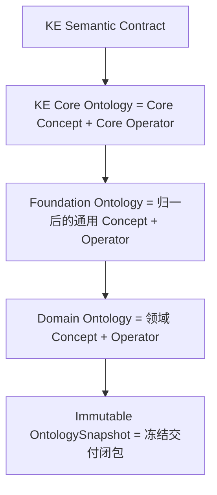
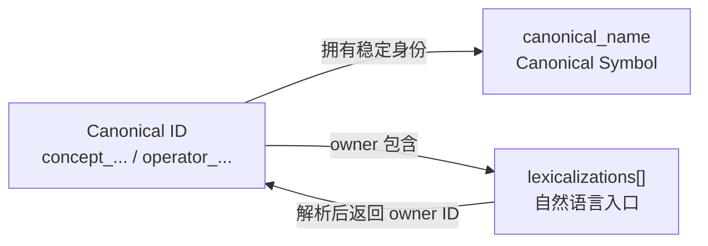

# memory-assertion/v1 规范词汇表

本词汇表冻结 `memory-assertion/v1` 的术语。英文标识符用于 JSON 与互操作，中文解释用于规范阅读。相似词不能跨层替换。

## 规范关键词

| 关键词 | 含义 |
| --- | --- |
| 必须 | 合同要求；不满足即无效 |
| 不得 | 合同禁止；出现即无效 |
| 可以 | 在其余约束均满足时允许 |
| fail-closed | 缺少精确信息或能力时拒绝，不猜测、不降级 |
| authoritative | 由指定事实源拥有权威，不等同于模型判断为真 |

## Ontology 与身份

### Ontology

`Ontology = Concept + Operator`。Ontology 的本体身份只有 `Concept` 与 `Operator`；参数名称、词面、字面量 codec、外部映射和构建审计记录都不是额外本体身份。

### 定义层

活动设计的定义层按以下顺序组织：



这些是语义和治理层，不是五种运行时对象。Core、Foundation、Domain 最终都使用同一套 Concept/Operator 身份空间；物理上只通过 manifest 引用的 `ontology`、`concepts[]`、`operators[]` 分片交付。不得因为分层而复制同义 canonical ID。

### Canonical ID

`Ontology.id`、`Concept.id` 与 `Operator.id` 是上游生成并持久化的稳定 hash ID：

```text
ontology_<12 lowercase hex>
concept_<12 lowercase hex>
operator_<12 lowercase hex>
```

ID 是权威身份。名称、描述、来源、词面或非语义性展示修订不得重算 ID；语义定义发生不兼容变化时必须创建新 ID，并以 `deprecated/replaced_by` 连接旧身份。

### Canonical Symbol

本 Profile 直接收紧上游 `canonical_name`，不新增平行字段：

```text
Concept canonical_name  ^[A-Z][A-Za-z0-9]*$
Operator canonical_name ^[a-z][a-z0-9_]*$
```

Concept Symbol 与 Operator Symbol 分别在精确 Snapshot 内唯一。Canonical Symbol 参与 Canonical Text，但不拥有身份。

### Lexicalization

Lexicalization 是自然语言词面到所属 Concept/Operator 的识别入口。它只内嵌在 owner 的 `supply.memory_assertion.lexicalizations[]` 中；owner ID 由包含关系确定。Lexicalization 不是 Canonical ID，也不是 Canonical Symbol。



同一词面可以在多个 owner 上分别为 `resolved`；`resolved` 只确认一条“词面-owner”映射，不保证全局单义。具体出现仍必须按上下文、Concept 类型和 Operator 签名消歧。

### 三层身份不得混用

| 层 | 例子 | 可否作为权威引用 |
| --- | --- | --- |
| Canonical ID | `operator_fe9dd6d99ebf` | 可以 |
| Canonical Symbol | `created_by` | 只在绑定 Snapshot 的文本环境中可以解析回 ID |
| Lexicalization | `创建`、`create` | 不可以直接作为权威引用 |

“创建”记录不是到英文 `create` 的翻译边；两者是在同一 owner 下独立、有来源的 lexicalization。

### provenance_refs

`provenance_refs[]` 是 opaque audit locator 数组，用来回指已经存在并经过责任方预验证的来源或审核记录。Snapshot 内容中的 locator 由 Snapshot 构建方预验证；调用方提供的运行时对象中的 locator 由调用方预验证。NL2KE 不解析 locator 的内部语法，不从字符串推断语义，也不要求其目标出现在单次 compile request 中。因此，`provenance_refs[]` 不属于请求内部引用闭包，不能替代 `source_evidence_ids[]`、artifact hash 或 `source_manifest`。

## Operator

Operator 是有序函数签名：

```text
input_concepts[] -> output_concept
```

`arguments[n]` 对应 `input_concepts[n]`。`positional_parameters[n]` 只给该位置提供局部名称、定义和约束说明，不创建全局参数身份。一个 Operator 恰有一个 `output_concept`。

### proposition_operation

Operator 对命题的作用只允许：

```text
none | modifier | attitude | relation
```

输出形态由 `output_concept` 决定，不另存函数/谓词分类。

### function_semantics

Operator 的解释合同包含：

| 字段 | 封闭值 | 含义 |
| --- | --- | --- |
| `purity` | v1 恒为 `pure` | 结果只依赖有序签名中的全部显式输入 |
| `deterministic` | v1 恒为 `true` | 同一完整输入在同一解释合同下结果确定 |
| `partiality` | `total`、`partial` | 对全部签名输入有定义，或只在封闭条件下有定义 |

时间、状态版本或数据快照若影响结果，必须成为普通的有序输入，并由 `input_concepts[]` 与 `positional_parameters[]` 完整声明；显式依赖仍然是 `pure`，不得增加第二个 purity 枚举或 `state_parameter_indexes`。`partial` 必须给出可机器验证的封闭 `definedness_contract`，`total` 禁止携带该字段；但 `memory-assertion/v1` runtime Snapshot 尚不交付可内容寻址的 definedness registry，因此 provisioning 必须无条件拒绝任何 `partial` Operator，`required_capabilities[]` 不能绕过该规则。

这些字段只约束 Operator 如何解释。它们不声称 LLM 能复现结果，不判断来源事实真值，不承诺知识库完备性，不表达 cardinality，也不执行 Admission。

## Knowledge Equation 与 Term

### KnowledgeEquation

```text
KnowledgeEquation := OperatorApplication "=" LeafTerm
```

`=` 是真实的 many-sorted equality。JSON 只保存规范方向 `lhs=OperatorApplication`、`rhs=LeafTerm`；该方向不是赋值方向，也不是现实真值或 Admission 结果。

### OperatorApplication

复合 Term，字段为 `kind=operator_application`、`operator_id` 和有序 `arguments[]`。每个 argument 必须是 `LeafTerm`，其 Concept 与对应 `input_concepts[n]` 兼容。

### LeafTerm

`LeafTerm` 恰好是以下五种联合之一：

| `kind` | 必要身份/值 | 作用域 |
| --- | --- | --- |
| `individual_ref` | `individual_id` | `local` 或 `canonical` |
| `typed_value` | `concept_id` + `canonical_value` | 由 literal-bearing Concept 约束 |
| `assertion_ref` | `assertion_id` | `candidate` 或 `canonical` |
| `ontology_concept_ref` | `concept_id` | 精确 Snapshot |
| `ontology_operator_ref` | `operator_id` | 精确 Snapshot |

`OperatorApplication` 不是 `LeafTerm`。`typed_value` 的 `concept_id` 必须指向声明 `literal_value_contract` 的 Concept；Profile 不创建独立顶层 ValueType 身份。

裸 `LeafTerm = LeafTerm` 不属于本 Profile。实体归一、身份合并、候选接纳和冲突处理必须由各自流程完成，不能伪装成 KE。

### AssertionRef

`scope=candidate` 只解析当前 hypothesis 的 candidate assertion ID table；`scope=canonical` 只解析共享 canonical assertion ID table。Canonical Text 始终把 ID 写成 JSON string，例如：

```text
Assertion::candidate::"created-by-1"
```

### Hypothesis

Hypothesis 是同一 compile 输入在同一 OntologySnapshot 下的一种完整解析候选。多个 `hypotheses[]` 构成互斥替代集合，不得跨 hypothesis 合并 local declarations、candidate IDs 或 candidate graph。Hypothesis 之间的差异不是已判定的事实冲突；NL2KE 不执行跨 turn conflict、merge、supersession、Admission 或 lifecycle 更新。

### Capability Gap

Capability Gap 表示 Semantic Contract、Profile 或 NL2KE 能力不能表达某个来源构造。`memory-assertion/v1` 不支持 quantifier、variable binding、`AND`、`OR` 或 `IF`：前两者分别报告 `construct=quantifier`、`construct=variable_binding`，`AND`/`OR` 报告 `construct=logical_connective`，`IF` 报告 `construct=conditional`；统一使用 `reported_capability_gaps[].code=unsupported_construct`。Capability Gap 不得报告为 Ontology Gap。

## 文本与存储

### Authoritative JSON

完成结构、类型、引用、作用域和证据闭包校验后的 JSON。它是运行时权威语义载体；JCS 字节用于 hash。

### Canonical Text

绑定 `snapshot_id + sha256`、individual bindings 和 assertion ID tables 的确定性可逆投影。示例：

```text
created_by(Model__gpt_4,Organization__openai)=Boolean::true
```

### Display Text

面向人的本地化展示。可以省略 ID、增加空格或改写措辞；不得反向解析、参与 hash 或替代 Authoritative JSON。

## OntologySnapshot

`OntologySnapshot` 是 manifest 与其引用的全部上游分片形成的不可变逻辑闭包。它只包含交付元数据以及 Ontology、Concept、Operator；manifest 恰好引用一个 `ontology` artifact，且至少引用一个 `concepts` 和一个 `operators` artifact。分片分别只含对应的一种上游顶层字段。KE、Assertion、Candidate、Evidence、Admission 和 lifecycle 状态都不属于 OntologySnapshot。

Snapshot identity 是 `snapshot_id + sha256`。单次 compile 请求只传这两个字段；内联 expanded bundle 只能作为测试派生视图，不能成为第二份权威。

## MemorySnapshot

`MemorySnapshot` 是为未来“事实与记忆状态快照”保留的名称。若后续版本需要冻结已接纳 Assertion、修订、来源和 lifecycle 状态，必须使用独立于 OntologySnapshot 的 artifact 与合同，并显式引用其依赖的 OntologySnapshot。`MemorySnapshot` 不属于 `memory-assertion/v1` 当前已定义 artifact，当前文档不为它规定 JSON Schema。

## 统一示例身份

| kind | ID | `canonical_name` |
| --- | --- | --- |
| Ontology | `ontology_9a0634222551` | `MemoryAssertionExample` |
| Concept | `concept_58fa53e5ab6d` | `Entity` |
| Concept | `concept_72c9781aa03b` | `Person` |
| Concept | `concept_32ad50552813` | `Organization` |
| Concept | `concept_fd8836ad6c9c` | `Model` |
| Concept | `concept_b39c9a889cc6` | `Boolean` |
| Concept | `concept_9bdb3283cc8f` | `Date` |
| Concept | `concept_441bafa9e9ed` | `Proposition` |
| Concept | `concept_b809c63d2ee0` | `Quantity` |
| Concept | `concept_400b1a5cb986` | `Decimal` |
| Concept | `concept_35f01a413e72` | `DateTime` |
| Concept | `concept_8b17e273c98f` | `Duration` |
| Concept | `concept_b4bdacfaaec4` | `Money` |
| Concept | `concept_13c81bbb1b78` | `Text` |
| Operator | `operator_fe9dd6d99ebf` | `created_by` |
| Operator | `operator_7e2261ee9c51` | `possible` |
| Operator | `operator_61921190c148` | `event_time` |
| Operator | `operator_0e0ca38b526f` | `believes` |

## 明确废止的模型

活动合同不得恢复额外的全局参数本体层、designated output、命题 qualifiers、独立顶层 ValueType、顶层 Lexicalization、旧 `operator_form` 或 `extensional` 字段。旧词只可出现在迁移审计或明确的拒绝测试中，不得被描述为当前能力。
