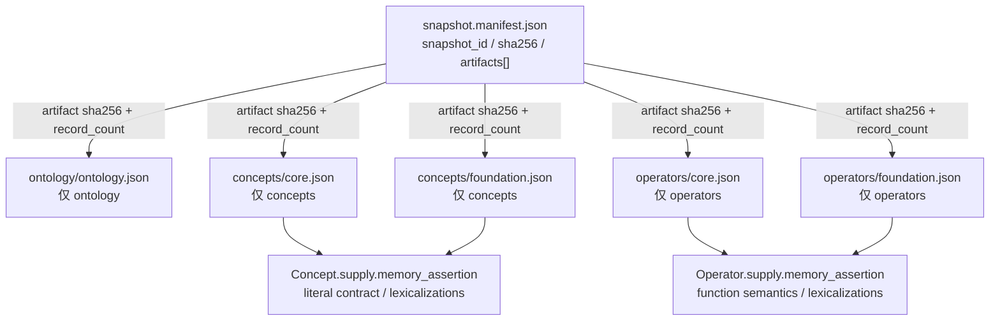

# OntologySnapshot 打包标准

本标准定义 `memory-assertion/v1` 的不可变 OntologySnapshot：一个 content-addressed manifest 引用若干符合上游 Ontology Storage Specification v1 的互斥分片。Snapshot 是逻辑闭包，不是把所有本体记录内联进一个 JSON 对象。

## 1. 权威打包形态



生产 Snapshot 必须满足：

- manifest 恰好引用一个 `artifact_kind=ontology`；
- manifest 至少引用一个 `artifact_kind=concepts`；
- manifest 至少引用一个 `artifact_kind=operators`；
- ontology artifact 顶层只含 `ontology`；
- concepts artifact 顶层只含非空 `concepts[]`；
- operators artifact 顶层只含非空 `operators[]`；
- 每个分片分别通过上游 `ontology.schema.json`；
- 所有 Concept/Operator 引用在全部分片的联合闭包内解析。

manifest 不得内联 `ontology`、`concepts` 或 `operators`，也不得增加其他本体身份集合。literal contract、Lexicalization 与 Operator 解释合同都保存在所属 Concept/Operator 的 `supply.memory_assertion` 内，并随分片参与 hash。

## 2. Manifest 字段

manifest 使用 `schema/ontology-snapshot-manifest.schema.json` 校验。

| 字段 | 约束 | 语义 |
| --- | --- | --- |
| `document_kind` | 恒为 `ontology_snapshot_manifest` | 文档类型 |
| `ontology_schema_id` | 恒为上游 v1 Schema ID | 绑定上游分片合同 |
| `semantic_contract_version` | 恒为 `memory-assertion/v1` | 绑定语义合同 |
| `profile` | 恒为 `memory-assertion/v1` | 绑定 Profile |
| `snapshot_id` | 非空 Runtime ID | 发布者分配的 Snapshot 名称 |
| `sha256` | 64 位小写十六进制 | 根摘要 |
| `source_manifest[]` | 至少一项 | 构建来源、内容摘要与 provenance IRI 回指 |
| `required_capabilities[]` | 唯一 capability ID | 消费者必须全部支持 |
| `artifacts[]` | 至少三项 | 上游分片路径、hash 和记录数 |

`source_manifest[].source_kind` 使用封闭值：

```text
core_ontology
foundation_ontology
domain_ontology
source_artifact
```

其中 `source_artifact` 用于 WordNet、PropBank、Schema.org 等构建输入的审计回指；这些来源记录不成为运行时 Concept/Operator 身份。

每个 `source_manifest[]` 项必须包含 `sha256`。该摘要是实际参与构建的来源清单或来源 artifact 的**原始字节 SHA-256**；它不使用分片的 JCS 摘要规则。`provenance_refs[]` 只提供环境无关回指，不替代内容寻址。来源内容改变时，即使路径和版本字符串不变，也必须改变来源摘要并生成新的 Snapshot。

构建器的 `IdentitySeedRegistry` 属于构建审计产物，不进入运行时 Snapshot；但可复现构建必须同时保存并复用它。示例 fixture 在 `build-audit/id-seeds.json` 保存 UUIDv4 seed 映射，验证器按上游 `kind:<uuid>` SHA-256 规则复算全部 18 个 ID。缺失 seed registry 时只能构建新身份，不能宣称复原既有 Canonical ID。

`artifacts[]` 项恰好包含：

| 字段 | 约束 |
| --- | --- |
| `artifact_kind` | `ontology`, `concepts`, `operators` |
| `path` | Snapshot 根下的 `ArtifactRelativePath`；只允许安全的 ASCII 文件路径，禁止绝对路径、URI scheme、反斜杠、`:`, `?`, `#`, `%`、`.`/`..` 路径段、空段和尾部 `/` |
| `media_type` | 恒为 `application/json` |
| `sha256` | 64 位小写十六进制 |
| `record_count` | 正整数；ontology 恒为 1 |

在统一示例中，ontology artifact 内的对象为 `ontology_9a0634222551 / MemoryAssertionExample`；Concept 分片包含 `concept_58fa53e5ab6d` 至 `concept_13c81bbb1b78`（13 项，包括六种扩展 literal fixture Concept），Operator 分片包含 `operator_fe9dd6d99ebf` 至 `operator_0e0ca38b526f`。

## 3. Manifest 结构示例

以下是随规范交付的 conformance fixture；实际文件位于 `fixtures/ontology-snapshot-example/`。它用于结构、hash 与闭包测试，不是生产 Foundation Ontology 发布物：

```json
{
  "document_kind": "ontology_snapshot_manifest",
  "ontology_schema_id": "https://genuineknowledge.com/specifications/ontology/v1/ontology.specification.json",
  "semantic_contract_version": "memory-assertion/v1",
  "profile": "memory-assertion/v1",
  "snapshot_id": "memory-assertion-example-v1",
  "sha256": "6163b7f30ed60650d3f4361d3a8368c3901619e92d25114bb4667339e1286787",
  "source_manifest": [
    {
      "source_id": "memory-assertion-example/v1",
      "source_kind": "core_ontology",
      "version": "1.0.0",
      "sha256": "8913911f3664c0a0061db575a401ad579534b58573808a2d998dd56038684dbd",
      "provenance_refs": [
        "sources/memory-assertion-example/v1/manifest.json"
      ]
    }
  ],
  "required_capabilities": [],
  "artifacts": [
    {
      "artifact_kind": "concepts",
      "path": "concepts/core.json",
      "media_type": "application/json",
      "sha256": "562c61c40518417771ed5a55a7db6482f2f91f32d5282184ee15afc042ba3c24",
      "record_count": 13
    },
    {
      "artifact_kind": "ontology",
      "path": "ontology/ontology.json",
      "media_type": "application/json",
      "sha256": "189faf1b88c0d6abbf6a70cd8f7c7569089c119e7e9ec88d3dc34a841e9a3902",
      "record_count": 1
    },
    {
      "artifact_kind": "operators",
      "path": "operators/core.json",
      "media_type": "application/json",
      "sha256": "dd098ca698095e32daa70b9d60911e68c0ba64e1e17e059a9f254c77277a33c3",
      "record_count": 4
    }
  ]
}
```

该向量的根摘要按第 5 节对所示 manifest 字段计算，并与 fixture 文件一致。通过该 fixture 只证明校验工具能够重放合同，不证明生产 Foundation Ontology 已经构建或发布。

## 4. 分片记录数与闭包

`record_count` 的定义固定为：

```text
artifact_kind=ontology  -> 1
artifact_kind=concepts  -> len(document.concepts)
artifact_kind=operators -> len(document.operators)
```

provisioning 必须在接受 Snapshot 前完成：

1. 路径安全检查，并拒绝绝对路径、`.`/`..`、反斜杠、`:`, `?`, `#`, `%`、重复路径和越界解析；逐段解析时拒绝 symbolic link、junction、mount point 等 reparse point 越过 Snapshot 根；
2. 逐 artifact 读取、NFC/JCS hash 校验和 `record_count` 校验；
3. 逐 artifact 运行上游 Schema，确认互斥顶层，并启用 `date-time`、`iri-reference` 的 Draft-07 FormatChecker（或等价的 RFC 3339/IRI 校验）；
4. 对每个 concepts/operators shard 再运行 `memory-assertion-ontology-profile.schema.json`，确认 `supply.memory_assertion`、Canonical Symbol、Lexicalization 和 source-attestation 条件；同时拒绝任何 `partial` Operator（v1 尚无内容寻址的 definedness registry）；
5. 确认恰好一个 ontology artifact，且 concepts/operators 均至少一个；
6. 确认 ontology ID 唯一，Concept ID 与 Operator ID 各自唯一；
7. 确认 Concept parents、disjoint 对称闭包、Operator 输入/输出、Profile 引用和 replacement 引用闭合；
8. 运行 Profile semantic validator，包含 `proposition_operation`、literal codec、partial quarantine 和跨分片类型检查；
9. 重算 manifest 根 hash 并与 `sha256` 比较；
10. 以 `snapshot_id + sha256` 原子发布不可变缓存。

任一步失败都必须拒绝整个 Snapshot，不得留下部分可用闭包。

Draft-07 的 `contains` 可以在 Schema 中保证三种 `artifact_kind` 各至少出现一次，但 Draft-07 没有 `maxContains`，不能对匹配项直接表达“最多一个 ontology”。因此“恰好一个 ontology”、artifact path 唯一、source ID 唯一、FormatChecker、reparse-point 安全、partial quarantine 和跨分片引用闭包是不可关闭的 provisioning semantic checks。Schema 通过不代表这些检查已经完成。

## 5. Canonicalization 与 hash

### 5.1 Artifact hash

每个 artifact 的摘要按以下确定性步骤计算：

1. 严格解析 JSON，并拒绝 UTF-8 BOM、重复对象 key 和非 JSON 数值；
2. 验证 I-JSON 输入域；
3. 递归把所有 JSON string value 和 object member name 规范化为 Unicode NFC；若 member name 规范化后碰撞，则拒绝文档；
4. 只按本节完整 JSON Pointer pattern 白名单规范化数组；
5. 使用 JSON Canonicalization Scheme (JCS) 序列化；
6. 编码为 UTF-8 字节；
7. 计算 SHA-256，并输出 64 位 lowercase hex。

进入 NFC/JCS 前必须验证 I-JSON 输入域：整数不得超出 `[-9007199254740991, 9007199254740991]`，不得包含非有限数，任何字符串或对象 key 都不得包含未配对 UTF-16 surrogate。违反者必须在 hash 前拒绝，不能依赖 JavaScript Number 舍入或实现相关的 Unicode 替换行为。

Concept/Operator 内嵌的 Profile、Lexicalization 和 SourceAttestation 均在 artifact 内，因此参与摘要。派生的只读词面索引不重复序列化，也不额外参与 hash。

JCS 本身不重排数组，因此构建器必须先执行本 Profile 的数组规范化。以下 pattern 均相对于当前被散列的单个 JSON 文档根，不相对于 expanded bundle 或 Snapshot 目录；manifest、ontology shard、concept shard 和 operator shard 分别独立应用。是否排序由数组的**完整 JSON Pointer pattern** 决定，不能只看末级字段名；下表中的 `*` 恰好匹配一个数组 index。只有完整路径命中白名单时才按指定稳定键排序，其他数组一律保持原序。

v1 的无序数组路径白名单如下：

| JSON Pointer pattern | 稳定键 |
| --- | --- |
| `/artifacts` | `(artifact_kind, path)` |
| `/source_manifest` | `(source_kind, source_id, version, sha256)` |
| `/source_manifest/*/provenance_refs`, `/required_capabilities`, `/ontology/sources` | NFC 后 UTF-8 字节序 |
| `/concepts`, `/operators` | `(id, canonical_name)` |
| `/concepts/*/parents`, `/concepts/*/sources`, `/operators/*/sources` | NFC 后 UTF-8 字节序 |
| `/concepts/*/supply/memory_assertion/disjoint_with` | NFC 后 UTF-8 字节序 |
| `/concepts/*/supply/memory_assertion/external_mappings`, `/operators/*/supply/memory_assertion/external_mappings` | `(source, external_id, relation)` |
| `/concepts/*/supply/memory_assertion/external_mappings/*/provenance_refs`, `/operators/*/supply/memory_assertion/external_mappings/*/provenance_refs` | NFC 后 UTF-8 字节序 |
| `/concepts/*/supply/memory_assertion/lexicalizations`, `/operators/*/supply/memory_assertion/lexicalizations` | `(language, NFC(surface_form), surface_relation, disambiguation_status)` |
| `/concepts/*/supply/memory_assertion/lexicalizations/*/source_attestations`, `/operators/*/supply/memory_assertion/lexicalizations/*/source_attestations` | `(source_kind, lemma, sense_id?, roleset_id?)` |
| `/concepts/*/supply/memory_assertion/lexicalizations/*/source_attestations/*/provenance_refs`, `/operators/*/supply/memory_assertion/lexicalizations/*/source_attestations/*/provenance_refs` | NFC 后 UTF-8 字节序 |
| `/concepts/*/supply/memory_assertion/literal_value_contract/currency_minor_units` | `currency` |
| `/operators/*/supply/memory_assertion/definedness_contract/required_input_indexes` | 数值升序 |

Operator 的 `/operators/*/input_concepts` 与 `/operators/*/supply/memory_assertion/positional_parameters`、KE 的 `arguments`、请求的 `source.messages` 均具有语义顺序，必须保持原序。上游允许其他 `supply` namespace 共存；这些 namespace 内即使出现 `parents`、`lexicalizations` 等同名字段，也不执行 `memory-assertion/v1` 的语义排序。其 string value 和 object member name 仍执行 NFC，object member 仍由 JCS 排序，但内部数组保持原序；全部 canonical bytes 参与 artifact hash，并通过 manifest 参与 Snapshot root hash。

相同稳定键的对象再以其 JCS 字节作最终 tie-breaker。实现不得使用 locale-sensitive 排序。

### 5.2 Root hash

根 `sha256` 按以下步骤计算：

1. 从 manifest 对象中只移除顶层 `sha256`；
2. 递归把所有 JSON string 规范化为 NFC；
3. 把 `artifacts[]` 按 `(artifact_kind, path)` 升序稳定排序；
4. 把 `source_manifest[]` 按 `(source_kind, source_id, version, sha256)` 升序，把每个 `provenance_refs[]` 与 `required_capabilities[]` 按 UTF-8 字节序升序；
5. 对所得对象执行 JCS；
6. 编码为 UTF-8；
7. 计算 SHA-256 lowercase hex。

上述已列入白名单的 manifest 数组均为语义无序集合；等价构建必须先规范排序，因此不得因输入顺序不同而产生不同根 hash。所有未命中完整路径白名单的数组保持原序；顺序变化会改变 canonical bytes 和相应 hash。

因为 manifest 包含所有 artifact digest，根摘要传递性绑定完整闭包。单独修改 Symbol、Lexicalization 或 description 都会产生新 Snapshot hash。不得改写旧实体记录来改变其历史含义；若修改实际改变语义定义，必须创建新的 canonical ID，并在旧对象的 Profile 中通过 `deprecated=true` 与 `replaced_by` 连接旧身份和新身份。

## 6. Runtime 引用与缓存

正常 compile 请求只允许传：

```json
{
  "ontology_snapshot_ref": {
    "snapshot_id": "memory-assertion-example-v1",
  "sha256": "6163b7f30ed60650d3f4361d3a8368c3901619e92d25114bb4667339e1286787"
  }
}
```

NL2KE 必须从本地不可变缓存解析精确 Snapshot。缓存缺失、root hash 不匹配、artifact 不完整、Schema 失败、语义校验失败或 required capability 不受支持时必须 fail-closed；不得降级到其他版本、临时访问网络或在请求中内联 Snapshot。

响应必须回显实际使用的 `snapshot_id + sha256`。Snapshot provisioning 是独立流程，不属于单次 compile 请求。

## 7. Expanded bundle

测试工具可以从已验证 manifest 和分片生成单文件 expanded bundle，以便小型 fixture 或人工查看。expanded bundle：

- 是可删除、可重建的派生视图；
- 不拥有独立 Snapshot identity；
- 不参与 root hash；
- 不能被 compile 请求直接内联；
- 不能与 manifest 并列成为第二份权威；
- 必须保留来源 manifest 的 `snapshot_id + sha256`，以便回查。

expanded bundle 生成成功不证明生产 Snapshot 已通过 provisioning；权威结论仍来自 manifest、原始分片和完整校验记录。
