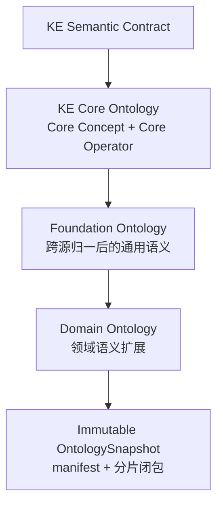
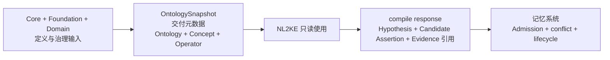

# Ontology Profile 标准

本标准定义上游 Ontology Storage Specification v1 在 `memory-assertion/v1` 下的受控 Profile。上游对象结构与 ID 规则保持不变；所有新增 Profile 数据只进入 `Concept.supply.memory_assertion` 和 `Operator.supply.memory_assertion`。此外，本 Profile 对既有 `canonical_name` 施加 Canonical Symbol 构词约束；这不是新增平行字段。

## 1. 上游边界

### 1.1 定义层与分片层

本 Profile 的定义层是：



`Core`、`Foundation` 和 `Domain` 是定义来源和治理边界，不是三套互相交错的运行时本体。它们产生的记录最终都落在同一 Snapshot 的 `concepts[]`/`operators[]` 分片中；分片目录可以按维护边界组织，但目录名不能改变语义身份。`OntologySnapshot` 只冻结已经解析、合并和校验的结果。

OntologySnapshot 的内容集合严格限定为交付元数据以及 Ontology、Concept、Operator。交付元数据包括 Snapshot identity、内容摘要、artifact manifest、来源清单和所需能力等用于定位、校验和复现交付物的信息，不产生额外本体身份。



KE、Assertion、Candidate、Evidence、Admission 结果和 lifecycle 状态都不得进入 OntologySnapshot。它们是使用本体解释或治理的运行时知识对象，不是本体定义。未来若需要冻结已接纳事实、修订和生命周期状态，该独立交付物必须称为 `MemorySnapshot`，并引用其使用的 OntologySnapshot；`MemorySnapshot` 不得与 OntologySnapshot 共用名称或内容合同，且不属于本 Profile v1 当前定义的 artifact。

Ontology 的身份集合固定为：

```text
Ontology = Concept + Operator
```

上游文件继续采用互斥顶层：

| artifact kind | 唯一顶层字段 | 记录数 |
| --- | --- | --- |
| ontology | `ontology` | 恰好 1 |
| concepts | `concepts` | 至少 1 |
| operators | `operators` | 至少 1 |

一个文件不得混合这些顶层字段。Profile 不修改 `id`、`description`、`sources`、`created_at`、`abstraction_method`、`parents`、`input_concepts`、`output_concept` 或 `version` 的上游意义。

### 1.2 `supply` namespace 隔离

上游 `supply` 是可由多个 Profile 共用的扩展容器。Concept/Operator 可以在 `supply.memory_assertion` 之外保留其他 sibling namespace；`memory-assertion/v1` validator 只解释并校验 `supply.memory_assertion`，不得把其他 namespace 中的字段解释为本 Profile 的 Concept 类型、Operator 签名、KE 语义、Admission 规则或记忆事实。未知 sibling namespace 的存在不表示 `memory-assertion/v1` 对其结构或语义背书，也不能补足本 Profile 的缺失字段或绕过其封闭合同。

其他 namespace 对本 Profile 是 opaque content，但不是 hash 外数据：它们随所属 Concept/Operator 分片完整进入 canonical bytes、artifact hash 和 Snapshot root hash。其 string value 和 object member name 仍执行 NFC，object member 仍由 JCS 排序；`memory-assertion/v1` 只对自身注册的完整数组路径执行语义无序排序，其他 namespace 内的数组保持原序。消费者不得删除、重排或改写这些 opaque 数据后仍声称使用原 `snapshot_id + sha256`。

权威 ID 是：

```text
ontology_<12 lowercase hex>
concept_<12 lowercase hex>
operator_<12 lowercase hex>
```

`canonical_name` 在本 Profile 中直接承担 Canonical Symbol，不增加第二个 symbol 字段：

```text
Concept  ^[A-Z][A-Za-z0-9]*$
Operator ^[a-z][a-z0-9_]*$
```

Concept 与 Operator 的 Symbol 分别在同一 Snapshot 内唯一。

## 2. 统一示例 Ontology

| kind | ID | `canonical_name` |
| --- | --- | --- |
| Ontology | `ontology_9a0634222551` | `MemoryAssertionExample` |
| Concept | `concept_58fa53e5ab6d` | `Entity` |
| Concept | `concept_72c9781aa03b` | `Person` |
| Concept | `concept_32ad50552813` | `Organization` |
| Concept | `concept_fd8836ad6c9c` | `Model` |
| Concept | `concept_b39c9a889cc6` | `Boolean` |
| Concept | `concept_9bdb3283cc8f` | `Date` |
| Concept | `concept_441bafa9e9ed` | `Proposition` |
| Concept | `concept_b809c63d2ee0` | `Quantity` |
| Concept | `concept_400b1a5cb986` | `Decimal` |
| Concept | `concept_35f01a413e72` | `DateTime` |
| Concept | `concept_8b17e273c98f` | `Duration` |
| Concept | `concept_b4bdacfaaec4` | `Money` |
| Concept | `concept_13c81bbb1b78` | `Text` |
| Operator | `operator_fe9dd6d99ebf` | `created_by` |
| Operator | `operator_7e2261ee9c51` | `possible` |
| Operator | `operator_61921190c148` | `event_time` |
| Operator | `operator_0e0ca38b526f` | `believes` |

示例 Operator 签名：

```text
created_by(Model, Organization) -> Boolean
possible(Proposition) -> Boolean
event_time(Proposition, Date) -> Boolean
believes(Person, Proposition) -> Boolean
```

`input_concepts[]` 是有序数组，`output_concept` 是唯一 Concept ID。多对多关系必须把所有参与项放进输入，并以 Boolean 输出补全，不得让同一输入绑定多个互不相等的 rhs。

## 3. Concept Profile

Concept 的 Profile 位于：

```text
Concept.supply.memory_assertion
```

其字段为封闭对象：

| 字段 | 必填 | 约束 |
| --- | --- | --- |
| `profile_version` | 是 | 恒为 `memory-assertion/v1` |
| `semantic_kind` | 是 | `entity`, `proposition`, `event`, `state`, `literal_value`, `ontology_symbol` |
| `lexicalizations[]` | 是 | 可以为空；每项遵循第 6 节 |
| `disjoint_with[]` | 否 | Concept hash ID 集合，不得重复 |
| `external_mappings[]` | 否 | `relation=exact|narrow|broad|related` |
| `literal_value_contract` | 条件必填 | 仅 `semantic_kind=literal_value` 允许且必须 |
| `deprecated` | 否 | Boolean；省略按未废止解释 |
| `replaced_by` | 条件 | 废止且存在替代身份时指向新 Concept hash ID |

`literal_value_contract` 定义 typed value 的封闭 codec，而不是创建新的本体身份。所有分支都包含 `codec_id`、`canonical_json_kind`、`equality_mode=canonical_json_identity` 和 `accepts_null=false`；Money 还必须内嵌 `currency_minor_units[]`，Quantity 还必须固定 `canonical_unit_symbol`。`typed_value.canonical_value` 必须按所属 Concept 的完整合同规范化。

本 Profile 的常用 codec registry 包括：

| `codec_id` | `canonical_json_kind` |
| --- | --- |
| `ke-literal:boolean/v1` | `boolean` |
| `ke-literal:text-nfc/v1` | `string` |
| `ke-literal:decimal/v1` | `string` |
| `ke-literal:date/v1` | `string` |
| `ke-literal:datetime/v1` | `string` |
| `ke-literal:duration/v1` | `string` |
| `ke-literal:money/v1` | `object` |
| `ke-literal:quantity/v1` | `object` |

这些 codec 的规范值语义固定如下；语言相关的默认解析、IEEE 754 浮点和未声明时区均不得参与 canonicalization：

| `codec_id` | canonical value 规则 |
| --- | --- |
| `ke-literal:boolean/v1` | JSON Boolean，只允许 `true` 或 `false` |
| `ke-literal:text-nfc/v1` | NFC 规范化 JSON string；保留大小写和有语义的空白 |
| `ke-literal:decimal/v1` | 十进制 JSON string；不得使用指数形式、前导 `+`、无意义前导零或尾随小数零；零固定为 `"0"` |
| `ke-literal:date/v1` | RFC 3339 full-date `YYYY-MM-DD`；必须是真实公历日期 |
| `ke-literal:datetime/v1` | RFC 3339 date-time string；输入 offset 必须先换算为 UTC，canonical value 只允许大写 `Z`；小数秒为可选的 1..9 位并去除无意义尾随零 |
| `ke-literal:duration/v1` | 仅表示非负 exact elapsed duration；唯一形式为 `PT<canonical-decimal-seconds>S`，例如 `PT0S`、`PT0.5S`、`PT3600S`；拒绝 year/month/week/calendar-day 语义及 `PT1H` 等替代表达 |
| `ke-literal:money/v1` | JCS object，恰含 `amount` 与 `currency`；currency 必须出现在所属 Concept 的 `currency_minor_units[]`；amount 使用该项声明的固定小数位，例如 CNY/2 对应 `"12.50"` |
| `ke-literal:quantity/v1` | JCS object，恰含 `value` 与 `unit`; value 使用 decimal codec，unit 必须逐码点等于所属 Concept 的 `canonical_unit_symbol` |

字符串日期或数值必须先通过对应 codec，再参与 JCS 和 equality。两个 lexical input 只有在规范化后产生完全相同的 canonical JSON value 时，才是相等 typed value。

Money 合同示例：

```json
{
  "codec_id": "ke-literal:money/v1",
  "canonical_json_kind": "object",
  "equality_mode": "canonical_json_identity",
  "accepts_null": false,
  "currency_minor_units": [
    {"currency": "CNY", "minor_units": 2},
    {"currency": "JPY", "minor_units": 0}
  ]
}
```

`currency_minor_units[]` 按 `currency` 的 UTF-8 字节序稳定排序且 currency 唯一。列表只声明该 Concept 接受的币种；不得在运行时查询外部 ISO 4217 表补齐或覆盖。金额零不得带负号，并按币种固定 scale，例如 CNY 的零是 `"0.00"`，JPY 的零是 `"0"`。

Quantity 合同示例：

```json
{
  "codec_id": "ke-literal:quantity/v1",
  "canonical_json_kind": "object",
  "equality_mode": "canonical_json_identity",
  "accepts_null": false,
  "canonical_unit_symbol": "kg"
}
```

v1 的一个 Quantity Concept 只固定一个 NFC 规范单位，不执行单位换算。需要不同规范单位时使用不同 Concept；需要跨单位 equality 时必须在后续 Profile 中显式冻结换算合同，不能由实现自行推断。

DateTime equality 使用 UTC-normalized canonical JSON identity。例如 `2026-08-08T08:00:00+08:00` 在进入 KE 前规范为 `"2026-08-08T00:00:00Z"`；带数值 offset 的字符串不是合法 canonical value。

`memory-assertion/v1` 的 codec 枚举是封闭合同。未知 codec 使 Snapshot 无效；不能只声明 `required_capabilities[]` 就扩展本 Profile。新增 codec 必须发布新版本 Profile/Schema，消费者不支持时拒绝 Snapshot，不得退化成无类型裸值。

### 3.1 `disjoint_with` 语义

`disjoint_with` 表示当前 Concept 与目标 Concept 的实例集合不相交。方向固定为对称关系，Snapshot 必须显式物化双向记录：若 A 列出 B，则 B 也必须列出 A。构建器和 semantic validator 必须：

- 禁止 Concept 与自身不相交；
- 禁止 Concept 与其任一祖先或后代不相交；
- 检查所有目标 ID 存在并物化对称边；
- 将不相交关系应用到双方的后代闭包；
- 当一个 Individual 的 `concept_ids[]` 经祖先闭包后同时命中不相交两侧时，拒绝该声明或 Candidate。

不得由调用方自行猜测缺失的反向边；缺失反向边使 Snapshot 校验失败。

## 4. Operator Profile

Operator 的 Profile 位于：

```text
Operator.supply.memory_assertion
```

其字段为封闭对象：

| 字段 | 必填 | 约束 |
| --- | --- | --- |
| `profile_version` | 是 | 恒为 `memory-assertion/v1` |
| `positional_parameters[]` | 是 | 长度等于 `input_concepts[]` |
| `proposition_operation` | 是 | `none`, `modifier`, `attitude`, `relation` |
| `function_semantics` | 是 | 第 4.2 节的封闭合同 |
| `definedness_contract` | 条件必填 | `partiality=partial` 必须，`total` 禁止 |
| `external_mappings[]` | 否 | `relation=exact|narrow|broad|related` |
| `lexicalizations[]` | 是 | 可以为空；每项遵循第 6 节 |
| `deprecated` | 否 | Boolean；省略按未废止解释 |
| `replaced_by` | 条件 | 废止且存在替代身份时指向新 Operator hash ID |

### 4.1 位置参数

`positional_parameters[n]` 只描述 `input_concepts[n]`：

```json
{
  "index": 0,
  "name": "model",
  "definition": "被判断创建来源的模型。"
}
```

每个 index 必须从 0 连续覆盖到 `input_concepts.length - 1`，数组顺序与 index 一致，name 在当前 Operator 内唯一。参数名只用于定义、审核与显示，不是可跨 Operator 引用的身份。

### 4.2 Function semantics

```json
{
  "purity": "pure",
  "deterministic": true,
  "partiality": "total"
}
```

约束：

- `purity` 在 v1 恒为 `pure`；
- `deterministic` 在 v1 恒为 `true`；
- `partiality` 只允许 `total` 或 `partial`；
- `partiality=partial` 时必须提供同级 `definedness_contract`；
- `partiality=total` 时禁止 `definedness_contract`。

时间、状态版本或数据快照若影响结果，必须作为普通有序输入出现在 `input_concepts[]` 中，并由同位置的 `positional_parameters[]` 说明。因为所有依赖已经显式进入函数参数，该 Operator 仍为 `purity=pure`；v1 不保存 `state_parameter_indexes`。

这些语义不承诺 LLM 可复现、不判断事实真值、不表示 KB 完备性或 cardinality，也不执行 Admission。

### 4.3 Partial Operator

v1 的封闭 definedness 形态为：

```json
{
  "contract_id": "ke-definedness/v1",
  "required_input_indexes": [0],
  "failure_behavior": "reject_application"
}
```

`required_input_indexes` 必须非空、唯一并落在 Operator 输入范围内。`ke-definedness/v1` 是封闭合同版本；它只允许由实现注册表解释已登记的 Operator-specific definedness predicate。注册表不是自然语言，也不是调用时可变的 DSL，必须随 `required_capabilities` 版本化绑定。

本规范发布的 Foundation Ontology v1 不发布任何非平凡 `partial` Operator。当前 `definedness_contract` 结构保留用于前向合同和构建审计，但 `memory-assertion/v1` 的运行时 Snapshot 不交付可内容寻址的 Operator-specific definedness registry，因此任何含 `partial` Operator 的 Snapshot 都必须 quarantine 并被 provisioning 拒绝；声明 capability 不能绕过这一规则。未来版本只有在把可执行定义域谓词及其 hash 纳入 Snapshot 交付闭包后，才能开放 `partial`。自然语言 description 不能替代该合同。

### 4.4 命题作用

统一示例使用：

| Operator | `proposition_operation` | 说明 |
| --- | --- | --- |
| `created_by` | `none` | 普通实体关系的 Boolean predicate，不直接操作 Proposition |
| `possible` | `modifier` | 接受 Proposition 的模态修饰 |
| `event_time` | `modifier` | 接受 Proposition 与 Date，以 Boolean 表示该命题是否具有该事件日期 |
| `believes` | `attitude` | Person 对 Proposition 的态度 |

`relation` 表示带有命题作用域的语义关系，例如 `entails(P1,P2)`、`contradicts(P1,P2)`，以及原文明确表达的 `supports(Evidence,P)`。至少一个输入必须是 Proposition；其他输入可以是 Evidence、Entity 或 Event，但必须由该 Operator 的有序签名明确约束。没有 Proposition 输入的普通实体关系使用 `none`，不能仅凭关系名称把它归入 `relation`。

`none` 用于不对 Proposition 进行上述操作的普通函数型 Operator。输出形态只由 `output_concept` 决定，不保存第二份函数/谓词分类。

`event_time` 采用 `event_time(Proposition,Date)->Boolean`，而不是 `event_time(Proposition)->Date`。后者并非对每个 Proposition 都有定义，会与 v1 runtime 对 `partial` Operator 的无条件拒绝冲突；Boolean relation 对所有类型合法的 `(Proposition,Date)` 输入都有确定的真值。

`proposition_operation` 不是说明性标签。semantic validator 必须根据 Concept 的 `semantic_kind` 与 literal codec 执行以下闭合规则：

| 值 | 输入规则 | 输出规则 |
| --- | --- | --- |
| `none` | 不得含 `semantic_kind=proposition` 的输入 | 由 `output_concept` 决定 |
| `modifier` | 恰好一个 Proposition 输入；可以有其他显式非 Proposition 参数 | 输出不得是 Proposition |
| `attitude` | 恰好一个 Proposition 输入，且至少一个非 Proposition 主体/来源输入 | v1 必须输出使用 `ke-literal:boolean/v1` 的 Concept |
| `relation` | 至少一个 Proposition 输入；其余输入必须按 Operator 的 `input_concepts[]` 签名校验 | v1 必须输出使用 `ke-literal:boolean/v1` 的 Concept |

`input_concepts[]` 中 Proposition 的位置同时确定 AssertionRef 的参数位置，不再增加 Role 或 proposition-scope 字段。若签名不满足上表，Snapshot 构建失败。AND、OR、IF 等会输出或构造 Proposition 的 connective 不属于 v1。

## 5. Boolean predicate

关系 Operator 把所有关系参与项放入 `input_concepts[]`，并以 `Boolean` 作为唯一 `output_concept`。统一示例：

```text
operator_fe9dd6d99ebf
created_by(Model, Organization) -> Boolean
```

因此合法 KE 是：

```text
created_by(Model__gpt_4,Organization__openai)=Boolean::true
```

不得使用 `Model__gpt_4=Organization__openai`，也不得以同一输入配多个互不相等 rhs 模拟多值关系。

## 6. Lexicalization

Lexicalization 只能内嵌于所属 Concept 或 Operator。以下完整 owner 展示中文“创建”和英文 `create` 如何共同属于 `operator_fe9dd6d99ebf`：

```json
{
  "id": "operator_fe9dd6d99ebf",
  "canonical_name": "created_by",
  "input_concepts": [
    "concept_fd8836ad6c9c",
    "concept_32ad50552813"
  ],
  "output_concept": "concept_b39c9a889cc6",
  "description": "Tests whether a model was created by an organization.",
  "sources": [
    "sources/memory-assertion-example/v1/manifest.json#/entities/created_by"
  ],
  "created_at": "2026-08-08T00:00:00Z",
  "supply": {
    "memory_assertion": {
      "profile_version": "memory-assertion/v1",
      "positional_parameters": [
        {
          "index": 0,
          "name": "model",
          "definition": "The model being related."
        },
        {
          "index": 1,
          "name": "organization",
          "definition": "The proposed creator organization."
        }
      ],
      "proposition_operation": "none",
      "function_semantics": {
        "purity": "pure",
        "deterministic": true,
        "partiality": "total"
      },
      "lexicalizations": [
        {
          "language": "zh-CN",
          "surface_form": "创建",
          "surface_relation": "canonical_label",
          "disambiguation_status": "resolved",
          "source_attestations": [
            {
              "source_kind": "human",
              "lemma": "创建",
              "provenance_refs": [
                "sources/memory-assertion-example/v1/manifest.json#/lexicalizations/create_zh"
              ]
            }
          ]
        },
        {
          "language": "en",
          "surface_form": "create",
          "surface_relation": "equivalent_expression",
          "disambiguation_status": "resolved",
          "source_attestations": [
            {
              "source_kind": "human",
              "lemma": "create",
              "provenance_refs": [
                "sources/memory-assertion-example/v1/manifest.json#/lexicalizations/create_en"
              ]
            }
          ]
        }
      ]
    }
  }
}
```

该结构的语义是“词面记录由 `created_by` owner 持有，并解析到其 Operator ID”。它不是“创建 -> 英文 create”的翻译映射；英文 `create` 是同一 owner 下另一条独立 lexicalization。不得再保存带 `target_id` 的顶层词汇表。

### 6.1 Lexicalization 字段

| 字段 | 约束 |
| --- | --- |
| `language` | 非空 BCP 47 风格语言标签 |
| `surface_form` | 非空词面 |
| `surface_relation` | `canonical_label`, `equivalent_expression`, `abbreviated_expression`, `surface_variant` |
| `disambiguation_status` | `resolved`, `candidate` |
| `source_attestations[]` | 至少一项 |

`candidate` 不能单独决定最终语义选择。`resolved` 也不保证全局单义：同一个 `(language, NFC(surface_form))` 可以在多个 Concept/Operator owner 上都有 resolved 记录，NL2KE 仍必须使用上下文、Concept 类型与 Operator 签名消歧。

派生索引的 v1 规范化键只做两步：语言标签按 Snapshot 中的原值保留，`surface_form` 先按 Unicode NFC 规范化；不得在规范索引中隐式大小写折叠、去标点、压缩空白或调用语言特定词干器。若实现提供额外搜索索引，必须标为非权威派生数据，不参与 Snapshot hash。

### 6.2 SourceAttestation

每条 attestation 必须 `additionalProperties=false`，并包含非空 `lemma` 和至少一个 `provenance_refs`。`source_kind` 是封闭枚举：

```text
wordnet | propbank | schema_org | human | domain_corpus
```

`provenance_refs[]` 中的每一项都是 opaque audit locator，只用于回到构建或来源审计系统中的既有记录。Snapshot 构建方必须在打包前验证这些 locator 的来源、权限和目标存在性；当同类字段出现在调用方提供的运行时对象中时，该预验证责任属于调用方。NL2KE 不得从 locator 字符串推断语义，也不要求在单次 compile request 内携带或解析其目标。换言之，`provenance_refs[]` 不属于请求内部引用闭包；Snapshot 的内容完整性仍由 manifest、artifact hash 和 `source_manifest` 保证，而不是由运行时解引用该字符串保证。

条件矩阵：

| `source_kind` | `sense_id` | `roleset_id` |
| --- | --- | --- |
| `wordnet` | 必须 | 禁止 |
| `propbank` | 禁止 | 必须 |
| `schema_org` | 禁止 | 禁止 |
| `human` | 禁止 | 禁止 |
| `domain_corpus` | 禁止 | 禁止 |

v1 的 source-native identity 必须显式携带版本命名空间：WordNet 3.0 使用 `wn30:<lemma>.<pos>.<sense-number>`，例如 `wn30:create.v.01`；PropBank 3.4 使用 `pb3.4:<roleset-id>`，例如 `pb3.4:create.01`。无版本的 `create.v.01` 或 `create.01` 必须拒绝，不能依赖 provenance 路径猜测来源版本。

合法的来源形态：

```json
{
  "source_kind": "wordnet",
  "lemma": "create",
  "sense_id": "wn30:create.v.01",
  "provenance_refs": ["resources/wordnet/3.0/index.sense#create"]
}
```

```json
{
  "source_kind": "propbank",
  "lemma": "create",
  "roleset_id": "pb3.4:create.01",
  "provenance_refs": ["resources/propbank/3.4/frames/create.xml#create.01"]
}
```

只有 lemma 而没有精确 sense/roleset 的记录不得声称来自 WordNet 或 PropBank，必须改用 `human` 或 `domain_corpus`。SourceAttestation 证明词面来源，不自动证明 owner 语义与外部资源完全等价。

### 6.3 其他映射

Lexicalization 不使用 `mapping_relation`。Concept 与 Operator 的 `ExternalMapping.relation` 保留独立封闭值：

```text
exact | narrow | broad | related
```

映射方向固定为“Canonical owner -> external target”：

- `exact`：owner 与 external target 的定义和外延等价；
- `narrow`：owner 的外延严格窄于 external target；
- `broad`：owner 的外延严格宽于 external target；
- `related`：只声明语义相关，不声明等价或包含方向。

只有 `exact` 可以支持 identity-level 合并提案；仍必须经过构建治理。`narrow`、`broad`、`related` 不得改变 Canonical ID。

构建阶段 SourceMapping、crosswalk 和来源决策属于审计产物，只由 Snapshot `source_manifest` 与 provenance 回指；它们不是运行时 KE 可引用身份。

## 7. 语义校验

semantic validator 至少必须检查：

- Concept 继承引用存在、无自父边且整体为 DAG；
- `disjoint_with` 无自边、无祖先/后代冲突并显式双向闭合；
- Concept/Operator Symbol 分域唯一；
- `positional_parameters[]` 与有序 `input_concepts[]` 一一对应；
- `proposition_operation` 与 Proposition 输入数量、非 Proposition 主体以及 Boolean/non-Proposition 输出规则一致；
- `required_input_indexes` 范围有效且唯一；
- total/partial 与 `definedness_contract` 条件一致；
- literal-bearing Concept 与 `literal_value_contract` 条件一致；
- `deprecated/replaced_by` 类型和目标引用有效；
- Lexicalization owner 唯一、SourceAttestation 条件分支合法；
- ExternalMapping 与 Lexicalization 的关系枚举未混用；
- 所有 ID 引用在同一 Snapshot 闭包内解析。

本标准只定义这些检查，不证明相应 validator 或 Foundation Ontology 数据已经实现或通过验收。

## 8. Profile Schema 的离线加载

`memory-assertion-ontology-profile.schema.json` 使用相对于该 Schema 文件的 `$ref` 指向 vendored upstream Schema。实现必须以 Schema 文件所在目录的 `file URI` 作为 retrieval base，或在本地 registry 中显式注册同一 vendored upstream 文件；不得按远程网络位置解析，也不得静默替换另一版本。加载后必须同时执行 Draft-07 `check_schema`、上游 Schema、Profile Schema 和带 FormatChecker 的格式断言。
